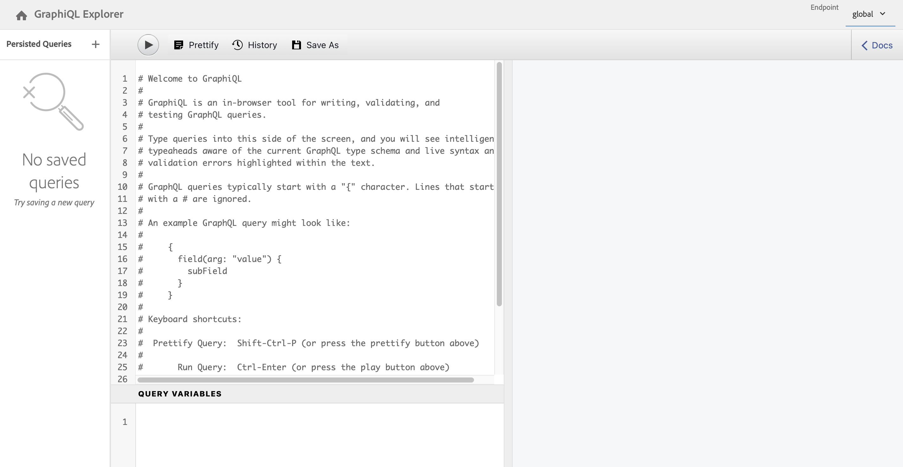
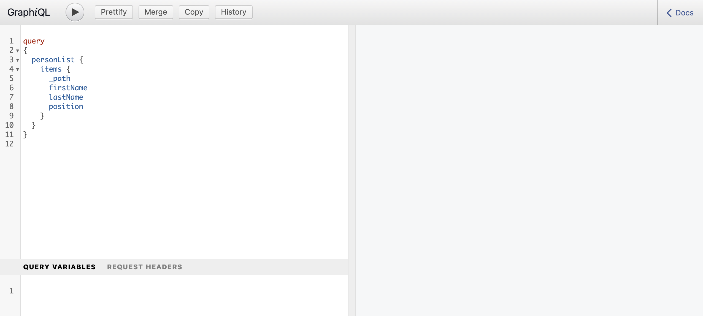

# 访问和交付内容片段Headless快速入门指南 {#accessing-delivering-content-fragments}

了解如何使用AEM Assets REST API管理内容片段，以及如何使用GraphQL API无头交付内容片段内容。

## 什么是 GraphQL 和 Assets REST API？ {#what-are-the-apis}

[现在您已经创建了一些内容片段，](create-content-fragment.md)您可以使用 AEM 的 API 以 Headless 的方式投放它们。

* [GraphQL API](/help/sites-developing/headless/graphql-api/graphql-api-content-fragments.md)允许您创建请求来访问和交付内容片段。
   * 若要使用此项，必须在AEM[中定义和启用](/help/sites-developing/headless/graphql-api/graphql-endpoint.md#enabling-graphql-endpoint)端点，如有必要，还必须安装[GraphiQL接口](/help/sites-developing/headless/graphql-api/graphql-api-content-fragments.md#installing-graphiql-interface)。
* [Assets REST API](/help/assets/assets-api-content-fragments.md) 让您创建和修改内容片段（及其他资源）。

本指南的剩余部分侧重于 GraphQL 访问和内容片段投放。

## 如何使用GraphQL投放内容片段 {#how-to-deliver-a-content-fragment}

信息架构师必须为其渠道端点设计查询才能交付内容。 每个端点、每个模型只考虑这些查询一次。 对于本快速入门指南，请仅创建一个。

1. 登录AEM并访问[GraphiQL接口](/help/sites-developing/headless/graphql-api/graphiql-ide.md)：
   * 例如：`http://<host>:<port>/aem/graphiql.html`。

1. GraphiQL是GraphQL的浏览器中查询编辑器。 您可以使用它来构建查询，以检索内容片段，并将它们作为JSON无意识地交付。
   * 左侧面板允许您构建查询。
   * 右侧面板显示结果。
   * 查询编辑器具备代码完成和热键功能，可以轻松地执行查询。
     

1. 假定您创建的模型名为 `person`，带有字段 `firstName`、`lastName` 和 `position`，您可以构建简单的查询来检索内容片段的内容。

   ```text
   query 
   {
     personList {
       items {
         _path
         firstName
         lastName
         position
       }
     }
   }
   ```

1. 在左侧面板中输入查询。
<!--
   
-->

1. 单击&#x200B;**执行查询** （右箭头）图标或使用`Ctrl-Enter`热键，结果将在右侧面板中显示为JSON。
   

1. 单击：
   * 页面右上方的&#x200B;**文档**&#x200B;显示上下文中的文档，帮助您构建适应您自己的模型的查询。
   * 顶部工具栏中的&#x200B;**History**&#x200B;显示以前的查询。
   * **另存为**&#x200B;和&#x200B;**保存**&#x200B;以保存您的查询，之后您可以从&#x200B;**持久查询**&#x200B;面板和&#x200B;**发布**中列出和检索它们。
     

GraphQL 启用结构化查询，不仅针对特定数据集或者单独的数据对象，而且还可以提供对象的特定元素，嵌套结果，提供查询变量支持，以及诸多功能。

GraphQL可以避免迭代API请求和过度投放。 相反，它允许作为对单个API查询的响应，批量精确投放所需呈现的内容。 生成的 JSON 可用于向其他站点或应用程序提供数据。

## 后续步骤 {#next-steps}

就是这样！现在，您已对 AEM 中的 Headless 内容管理有了基本了解。其中还有很多资源供您深入研究，以全面了解可用的功能。

* **[配置浏览器](create-configuration.md)** — 有关AEM配置浏览器的详细信息
* **[内容片段](/help/assets/content-fragments/content-fragments.md)** – 提供有关创建和管理内容片段的详细信息
* **[GraphiQL IDE](/help/sites-developing/headless/graphql-api/graphiql-ide.md)**，了解有关使用GraphiQL IDE的详细信息
* **[持久查询](/help/sites-developing/headless/graphql-api/persisted-queries.md)**，了解持久查询的更多详细信息
* **[AEM Assets HTTP API 中的内容片段支持](/help/assets/assets-api-content-fragments.md)** – 提供直接通过 HTTP API 使用 CRUD 操作（创建、读取、更新、删除）访问 AEM 内容的详细信息
* **[GraphQL API](/help/sites-developing/headless/graphql-api/graphql-api-content-fragments.md)** – 提供有关如何以 Headless 方式投放内容片段的详细信息
