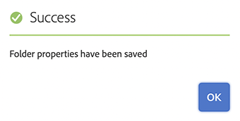

# 创建资源文件夹Headless快速入门指南 {#creating-an-assets-folder}

使用 AEM 内容片段模型定义内容片段的结构，也就是 Headless 内容的基础。然后，将内容片段存储在资源文件夹中。

## 什么是资源文件夹？ {#what-is-an-assets-folder}

[现在您已创建了内容片段模型](create-content-model.md)，这些模型定义了希望用于未来内容片段的结构，也许您会希望创建一些片段。

但是，您首先需要创建用于存储这些内容的资源文件夹。

资源文件夹用于 [组织传统内容资产](/help/assets/manage-assets.md) 如图像和视频以及内容片段。

## 如何创建资源文件夹 {#how-to-create-an-assets-folder}

管理员只需要偶尔创建文件夹，在创建内容时用于组织内容。对于本指南快速入门，我们只需要创建一个文件夹。

1. 登录AEM，从主菜单选择 **导航>资产>文件**.
1. 单击 **“创建”>“文件夹”**.
1. 提供文件夹的&#x200B;**标题**&#x200B;和&#x200B;**名称**。
   * **标题**&#x200B;应为描述性的。
   * **名称**&#x200B;将成为存储库中的节点名称。
      * 它会根据标题自动生成，并根据 [AEM 命名约定](/help/sites-developing/naming-conventions.md)进行调整。
      * 如有必要可以调整。

   
1. 选择您创建的文件夹，然后选择 **属性** 工具栏中(或使用 `p` [键盘快捷键。](/help/sites-authoring/keyboard-shortcuts.md))
1. 在&#x200B;**属性**&#x200B;窗口中，选择 **Cloud Services** 选项卡。
1. 对于&#x200B;**云配置**，选择[您之前创建的配置。](create-configuration.md)
   
1. 单击“**保存并关闭**”。
1. 单击 **确定** 在确认窗口中。

   

您可以在创建的文件夹中创建其他子文件夹。 子文件夹将继承父文件夹的&#x200B;**云配置**。但是，如果您希望使用来自其他配置的模型，则可以覆盖此项。

如果您使用本地化的站点结构，则可以在新文件夹下[创建语言根](/help/assets/multilingual-assets.md)。

## 后续步骤 {#next-steps}

现在您已经为内容片段创建了文件夹，接下来可以转到快速入门指南的第四部分并[创建内容片段](create-content-fragment.md)。

>[!TIP]
>
>有关管理内容片段的完整详细信息，请参阅[内容片段文档](/help/assets/content-fragments/content-fragments.md)
