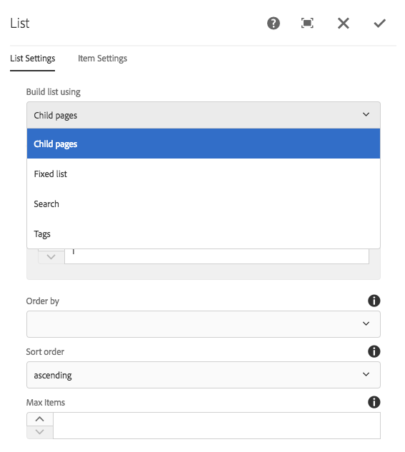

# 使用隐藏条件 {#using-hide-conditions}

隐藏条件可用于确定是否呈现组件资源。 例如，当模板作者在[模板编辑器](/help/sites-authoring/templates.md)中配置核心组件[列表组件](https://experienceleague.adobe.com/docs/experience-manager-core-components/using/wcm-components/list.html?lang=zh-Hans)并决定禁用基于子页面构建列表的选项时。 在“设计”对话框中禁用此选项可设置属性，以便在呈现列表组件时，计算隐藏条件并且不显示显示子页面的选项。

## 概述 {#overview}

对于用户而言，对话框可能会因大量选项而变得复杂，用户只能使用自己手头的一小部分选项。 这可能会导致用户获得铺天盖地的用户界面体验。

通过使用隐藏条件，管理员、开发人员和超级用户能够基于一组规则来隐藏资源。 此功能允许他们决定在作者编辑内容时应该显示哪些资源。

>[!NOTE]
>
>基于表达式隐藏资源不会替换ACL权限。 内容保持可编辑状态但不会显示。

## 实施和使用详细信息 {#implementation-and-usage-details}

`com.adobe.granite.ui.components.FilteringResourceWrapper`负责根据位于要过滤的字段上的`granite:hide`属性的存在和值来过滤资源。 `/libs/cq/gui/components/authoring/dialog/dialog.jsp`的实现包括`FilteringResourceWrapper.`的实例

该实现使用Granite [ELResolver API](https://developer.adobe.com/experience-manager/reference-materials/6-5/granite-ui/api/jcr_root/libs/granite/ui/docs/server/el.html)，并通过ExpressionCustomizer添加`cqDesign`自定义变量。

以下是位于`etc/design`下或作为内容策略的设计节点上隐藏条件的一些示例。

```
${cqDesign.myProperty}
${!cqDesign.myProperty}
${cqDesign.myProperty == 'someText'}
${cqDesign.myProperty != 'someText'}
${cqDesign.myProperty == true}
${cqDesign.myProperty == true}
${cqDesign.property1 == 'someText' && cqDesign.property2 || cqDesign.property3 != 1 || header.myHeader}
```

定义隐藏表达式时，请牢记以下事项：

* 要有效，应表示找到属性的范围（例如，`cqDesign.myProperty`）。
* 值为只读。
* 功能（如有必要）应限于服务提供的一组给定功能。

## 示例 {#example}

隐藏条件的示例可在整个AEM中找到，特别是[核心组件](https://experienceleague.adobe.com/docs/experience-manager-core-components/using/introduction.html?lang=zh-Hans)。 例如，考虑[列表核心组件](https://experienceleague.adobe.com/docs/experience-manager-core-components/using/wcm-components/list.html?lang=zh-Hans)。

[使用模板编辑器](/help/sites-authoring/templates.md)，模板作者可以在“设计”对话框中定义列表组件中哪些选项可供页面作者使用。 可以启用或禁用此类选项，例如是否允许列表为静态列表、子页面的列表、已标记页面的列表等。

如果模板作者选择禁用子页面选项，则会设置设计属性并根据该属性评估隐藏条件，这会导致不为页面作者呈现该选项。

1. 默认情况下，页面作者可以使用列表核心组件，通过选择选项&#x200B;**子页面**&#x200B;来使用子页面构建列表。

   

1. 在列表核心组件的“设计”对话框中，模板作者可以选择选项&#x200B;**禁用子项**，以防止向页面作者显示基于子页面的列表生成选项。

   

1. 在`/conf/we-retail/settings/wcm/policies/weretail/components/content/list`下创建了一个策略节点，属性`disableChildren`设置为`true`。
1. 隐藏条件定义为对话框属性节点`/conf/we-retail/settings/wcm/policies/weretail/components/content/list`上的`granite:hide`属性的值

   

1. `disableChildren`的值是从设计配置中提取的，表达式`${cqDesign.disableChildren}`的计算结果为`false`，这意味着该选项将不会作为组件的一部分呈现。

   您可以在GitHub[&#128279;](https://github.com/adobe/aem-core-wcm-components/blob/main/content/src/content/jcr_root/apps/core/wcm/components/list/v1/list/_cq_dialog/.content.xml#L40)中查看作为`granite:hide`属性值的隐藏表达式。

1. 使用列表组件时，选项&#x200B;**子页面**&#x200B;不再为页面作者渲染。

   
