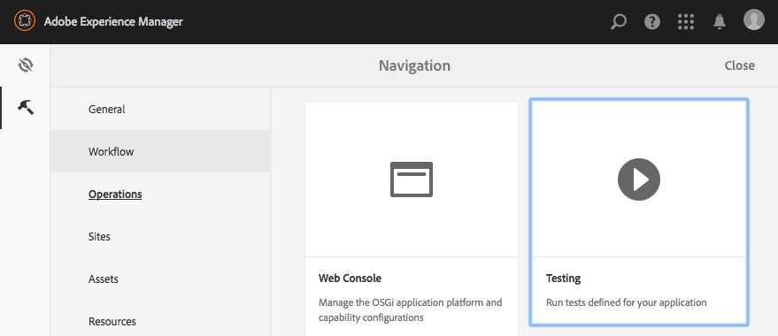

# 测试UI{#testing-your-ui}

>[!NOTE]
>
>从AEM 6.5开始，弃用hobbes.js UI测试框架。 Adobe不打算进一步增强其功能，因此建议客户使用Selenium自动化功能。
>
>请参阅[已弃用和已删除的功能](/help/release-notes/deprecated-removed-features.md)。

AEM提供了一个用于实现AEM UI测试自动化的框架。 使用该框架，您可以直接在Web浏览器中编写和运行UI测试。 该框架提供了用于创建测试的JavaScript API。

AEM测试框架使用Hobbes.js，这是一个使用JavaScript编写的测试库。 Hobbes.js框架是在开发过程中为测试AEM而开发的。 该框架现在可供公众用于测试您的AEM应用程序。

>[!NOTE]
>
>有关API的完整详细信息，请参阅Hobbes.js [文档](https://developer.adobe.com/experience-manager/reference-materials/6-5/test-api/index.html)。

## 测试结构 {#structure-of-tests}

在AEM中使用自动测试时，请务必了解以下术语：

| 操作 | **操作**&#x200B;是网页上的特定活动，如单击链接或按钮。 |
|---|---|
| 测试用例 | **测试用例**&#x200B;是由一个或多个&#x200B;**操作**&#x200B;组成的特定情况。 |
| 测试套件 | **测试套件**&#x200B;是一组相关的&#x200B;**测试用例**，它们共同测试特定用例。 |

## 执行测试 {#executing-tests}

### 查看测试包 {#viewing-test-suites}

打开测试控制台以查看已注册的测试包。 测试面板包含测试套件及其测试用例的列表。

通过&#x200B;**全局导航>工具>操作>测试**&#x200B;导航到工具控制台。



打开控制台时，左侧列出测试包，并附带按顺序运行所有测试包的选项。 带有方格背景的右侧显示的空间是一个占位符，用于在测试运行时显示页面内容。


### 运行单个测试套件 {#running-a-single-test-suite}

测试包可以单独运行。 运行测试包时，页面会随着测试用例及其操作的执行而更改，并且在测试完成后显示结果。 图标指示结果。

复选标记图标表示已通过测试：


“X”图标表示测试失败：


要运行测试套件，请执行以下操作：

1. 在测试面板中，单击要运行的测试用例的名称以展开操作的详细信息。

   

1. 单击&#x200B;**运行测试**。

   

1. 测试执行时，占位符会被替换为页面内容。

   

1. 通过点按或单击描述以打开&#x200B;**结果**&#x200B;面板来查看测试用例的结果。 在&#x200B;**结果**&#x200B;面板中点击或单击测试用例的名称会显示所有详细信息。

   

### 运行多个测试 {#running-multiple-tests}

测试包将按照它们在控制台中的显示顺序依次执行。 您可以深入到测试中查看详细结果。


1. 在“测试”面板上，单击要运行的测试包标题下方的&#x200B;**运行所有测试**&#x200B;按钮或&#x200B;**运行测试**&#x200B;按钮。

   

1. 要查看每个测试用例的结果，请单击测试用例的标题。 单击&#x200B;**结果**&#x200B;面板中测试的名称，将显示所有详细信息。

   

## 创建和使用简单测试套件 {#creating-and-using-a-simple-test-suite}

以下过程将引导您使用[We.Retail内容](/help/sites-developing/we-retail.md)创建和执行测试包，但您可以轻松修改测试以使用其他网页。

有关创建您自己的测试包的完整详细信息，请参阅[Hobbes.js API文档](https://developer.adobe.com/experience-manager/reference-materials/6-5/test-api/index.html)。

1. 打开CRXDE Lite。 ([https://localhost:4502/crx/de](https://localhost:4502/crx/de))
1. 右键单击`/etc/clientlibs`文件夹，然后单击&#x200B;**创建>创建文件夹**。 键入`myTests`作为名称，然后单击&#x200B;**确定**。
1. 右键单击`/etc/clientlibs/myTests`文件夹，然后单击&#x200B;**创建>创建节点**。 使用以下属性值，然后单击&#x200B;**确定**：

   * 名称：`myFirstTest`
   * 类型：`cq:ClientLibraryFolder`

1. 将以下属性添加到myFirstTest节点：

   | 名称 | 类型 | 价值 |
   |---|---|---|
   | `categories` | 字符串[] | `granite.testing.hobbes.tests` |
   | `dependencies` | 字符串[] | `granite.testing.hobbes.testrunner` |

   >[!NOTE]
   >
   >**仅限AEM Forms**
   >
   >
   >要测试自适应表单，请将以下值添加到类别和依赖关系中。 例如：
   >
   >
   >**类别**： `granite.testing.hobbes.tests, granite.testing.hobbes.af.commons`
   >
   >
   >**依赖项**： `granite.testing.hobbes.testrunner, granite.testing.hobbes.af`

1. 单击&#x200B;**全部保存**。
1. 右键单击`myFirstTest`节点，然后单击&#x200B;**创建>创建文件**。 命名文件`js.txt`并单击&#x200B;**确定**。
1. 在`js.txt`文件中，输入以下文本：

   ```
   #base=.
   myTestSuite.js
   ```

1. 单击&#x200B;**全部保存**，然后关闭`js.txt`文件。
1. 右键单击`myFirstTest`节点，然后单击&#x200B;**创建>创建文件**。 命名文件`myTestSuite.js`并单击&#x200B;**确定**。
1. 将以下代码复制到`myTestSuite.js`文件，然后保存该文件：

   ```
   new hobs.TestSuite("Experience Content Test Suite", {path:"/etc/clientlibs/myTests/myFirstTest/myTestSuite.js"})
      .addTestCase(new hobs.TestCase("Navigate to Experience Content")
         .navigateTo("/content/we-retail/us/en/experience/arctic-surfing-in-lofoten.html")
      )
      .addTestCase(new hobs.TestCase("Hover Over Topnav")
         .mouseover("li.visible-xs")
      )
      .addTestCase(new hobs.TestCase("Click Topnav Link")
         .click("li.active a")
   );
   ```

1. 导航到&#x200B;**测试**&#x200B;控制台，尝试您的测试套件。
