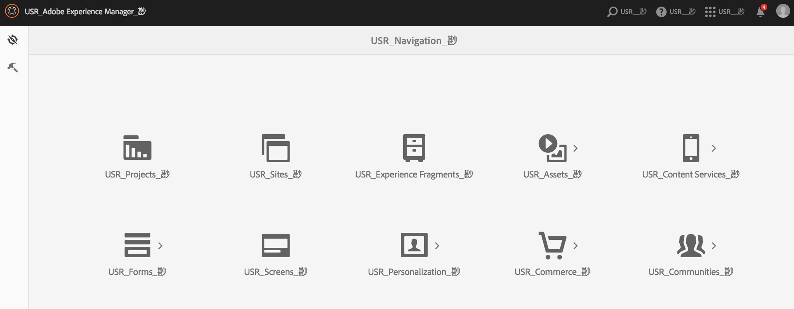

# 国际化UI字符串 {#internationalizing-ui-strings}

Java™和JavaScript API使您能够国际化以下资源类型中的字符串：

* Java™源文件。
* jsp脚本。
* 客户端库或页面源中的JavaScript。
* 对话框和组件配置属性中使用的JCR节点属性值。

有关国际化和本地化过程的概述，请参见 [国际化组件](/help/sites-developing/i18n.md).

## 在Java™和JSP代码中国际化字符串 {#internationalizing-strings-in-java-and-jsp-code}

此 `com.day.cq.i18n` Java™包允许您在UI中显示本地化的字符串。 此 `I18n` 类提供 `get` 方法，用于从Adobe Experience Manager (AEM)词典中检索本地化的字符串。 唯一需要的 `get` method是英语中的字符串文字。 英语是UI的默认语言。 以下示例将单词本地化 `Search`：

`i18n.get("Search");`

使用英语标识字符串与典型的国际化框架不同，在典型的国际化框架中，ID用于标识字符串并在运行时引用字符串。 使用英语字符串文字具有以下优点：

* 代码易于理解。
* 默认语言的字符串始终可用。

### 确定用户的语言 {#determining-the-user-s-language}

可以通过两种方法确定用户首选的语言：

* 对于经过身份验证的用户，从用户帐户中的首选项确定语言。
* 所请求页面的区域设置。

用户帐户的语言属性是首选方法，因为它更可靠。 但是，用户必须登录才能使用此方法。

#### 创建I18n Java™对象 {#creating-the-i-n-java-object}

I18n类提供两个构造函数。 如何确定用户的首选语言决定了要使用的构造函数。

要以用户帐户中指定的语言呈现字符串，请使用以下构造函数（导入后） `com.day.cq.i18n.I18n)`：

```java
I18n i18n = new I18n(slingRequest);
```

构造函数使用 `SlingHTTPRequest` 以检索用户的语言设置。

要使用页面区域设置确定语言，请首先获取所请求页面的语言的ResourceBundle：

```java
Locale pageLang = currentPage.getLanguage(false);
ResourceBundle resourceBundle = slingRequest.getResourceBundle(pageLang);
I18n i18n = new I18n(resourceBundle);
```

#### 国际化字符串 {#internationalizing-a-string}

使用 `get` 方法 `I18n` 对象以国际化字符串。 唯一需要的 `get` 方法是要国际化的字符串。 该字符串对应于Translator字典中的字符串。 get方法在词典中查找字符串并返回当前语言的翻译。

第一个参数是 `get` 方法必须符合以下规则：

* 该值必须为字符串文字。 类型变量 `String` 不可接受。
* 字符串文字必须用一行表示。
* 该字符串区分大小写。

```xml
i18n.get("Enter a search keyword");
```

#### 使用翻译提示 {#using-translation-hints}

指定 [翻译提示](/help/sites-developing/i18n-translator.md#adding-changing-and-removing-strings) 用于区分词典中重复字符串的国际化字符串。 使用第二个可选参数 `get` 提供翻译提示的方法。 翻译提示必须与词典中项目的Comment属性完全匹配。

例如，词典包含字符串 `Request` 两次：一次作为动词，一次作为名词。 以下代码包含翻译提示作为中的参数 `get` 方法：

```java
i18n.get("Request","A noun, as in a request for a web page");
```

#### 在本地化句子中包含变量 {#including-variables-in-localized-sentences}

在本地化字符串中包含变量，以将上下文含义构建到句子中。 例如，在登录到Web应用程序后，主页显示消息“欢迎返回管理员”。 您的收件箱中有两封邮件。” 页面上下文确定用户名和消息数。

[在字典里](/help/sites-developing/i18n-translator.md#adding-changing-and-removing-strings)中，变量在字符串中表示为带括号的索引。 将变量的值指定为的参数 `get` 方法。 参数放在翻译提示的后面，并且索引与参数的顺序相对应：

```xml
i18n.get("Welcome back {0}. You have {1} messages.", "user name, number of messages", user.getDisplayName(), numItems);
```

国际化字符串和翻译提示必须与词典中的字符串和注释完全匹配。 您可以通过提供 `null` value作为第二个参数。

#### 使用静态Get方法 {#using-the-static-get-method}

此 `I18N` 类定义一个静态 `get` 方法，在必须本地化几个字符串时很有用。 除了对象的参数之外 `get` 方法，静态方法要求 `SlingHttpRequest` 对象或 `ResourceBundle` 您所使用的语言（根据您确定用户首选语言的方式）：

* 使用用户的语言首选项：提供SlingHttpRequest作为第一个参数。

  `I18n.get(slingHttpRequest, "Welcome back {}. You have {} messages.", "user name, number of messages", user.getDisplayName(), numItems);`
* 使用页面语言：提供ResourceBundle作为第一个参数。

  `I18n.get(resourceBundle,"Welcome back {}. You have {} messages.", "user name, number of messages", user.getDisplayName(), numItems);`

### 在JavaScript代码中国际化字符串 {#internationalizing-strings-in-javascript-code}

JavaScript API允许您在客户端上本地化字符串。 与 [Java™和JSP](#internationalizing-strings-in-java-and-jsp-code) 代码，JavaScript API使您能够识别要本地化的字符串，提供本地化提示，并在本地化的字符串中包含变量。

此 `granite.utils` [客户端库文件夹](/help/sites-developing/clientlibs.md) 提供JavaScript API。 要使用API，请在您的页面上包含此客户端库文件夹。 本地化函数使用 `Granite.I18n` 命名空间。

在显示本地化的字符串之前，请使用 `Granite.I18n.setLocale` 函数。 函数要求区域设置的语言代码作为参数：

```
Granite.I18n.setLocale("fr");
```

要呈现本地化的字符串，请使用 `Granite.I18n.get` 函数：

```
Granite.I18n.get("string to localize");
```

以下示例将字符串“Welcome back”国际化：

```
Granite.I18n.setLocale("fr");
Granite.I18n.get("string to localize", [variables], "localization hint");
```

函数参数不同于Java™ I18n.get方法：

* 第一个参数是要本地化的字符串文字。
* 第二个参数是注入到字符串文本中的值数组。
* 第三个参数是本地化提示。

以下示例使用JavaScript本地化“欢迎回来管理员”。 您的收件箱中有两封邮件。” 句子：

```
Granite.I18n.setLocale("fr");
Granite.I18n.get("Welcome back {0}. You have {1} new messages in your inbox.", [username, numMsg], "user name, number of messages");
```

### 从JCR节点国际化字符串 {#internationalizing-strings-from-jcr-nodes}

UI字符串通常基于JCR节点属性。 例如， `jcr:title` 页面的属性通常用作 `h1` 元素。 此 `I18n` 类提供 `getVar` 本地化这些字符串的方法。

以下示例JSP脚本检索 `jcr:title` 属性，并在页面上显示本地化的字符串：

```java
<% title = properties.get("jcr:title", String.class);%>
<h1><%=i18n.getVar(title) %></h1>
```

#### 指定JCR节点的转换提示 {#specifying-translation-hints-for-jcr-nodes}

类似于 [Java™ API中的翻译提示](#using-translation-hints)中，您可以提供翻译提示以区分词典中的重复字符串。 提供翻译提示作为包含国际化属性的节点的属性。 hint属性的名称由国际化属性的名称加上 `_commentI18n` 后缀：

`${prop}_commentI18n`

例如， `cq:page` 节点包含正在本地化的jcr：title属性。 提示作为名为jcr：title_commentI18n的属性的值提供。

### 测试国际化范围 {#testing-internationalization-coverage}

测试UI中的所有字符串是否已国际化。 要查看包含哪些字符串，请将用户语言设置为zz_ZZ，然后在Web浏览器中打开UI。 国际化字符串与存根翻译一起显示，格式如下：

`USR_*Default-String*_尠`

下图显示了AEM主页的存根翻译：



要为用户设置语言，请为用户帐户配置首选项节点的语言属性。

用户的首选项节点的路径如下所示：

`/home/users/<letter>/<hash>/preferences`


