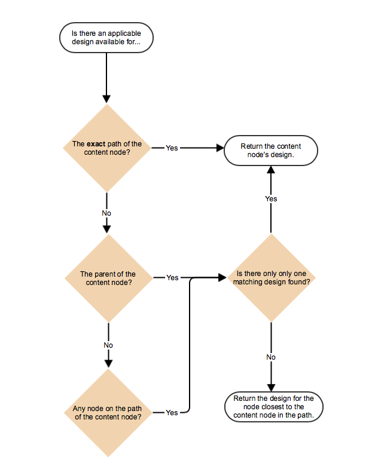
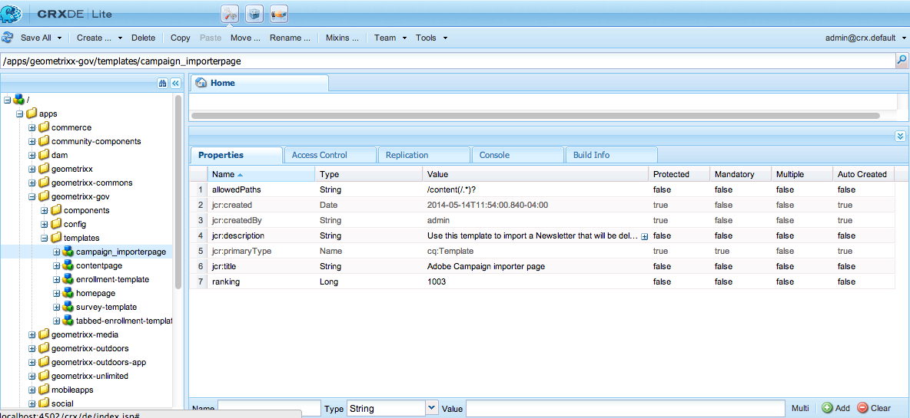

# 页面模板 — 静态{#page-templates-static}

模板用于创建页面，并定义可以在所选范围内使用的组件。 模板是一种节点层次结构，其结构与要创建页面的结构相同，但没有任何实际内容。

每个模板都会为您提供一系列可供使用的组件。

* 模板由以下项构建： [组件](/help/sites-developing/components.md)；
* 组件使用和允许对构件的访问，构件和构件用于呈现内容。

>[!NOTE]
>
>[可编辑的模板](/help/sites-developing/page-templates-editable.md) 也提供，是为获得最大灵活性和最新功能推荐的模板类型。

## 模板的属性和子节点 {#properties-and-child-nodes-of-a-template}

模板是cq：Template类型的节点，具有以下属性和子节点：

<table>
 <tbody>
  <tr>
   <td><strong>名称   </strong></td>
   <td><strong>类型   </strong></td>
   <td><strong>描述   </strong></td>
  </tr>
  <tr>
   <td>.   </td>
   <td> cq:Template</td>
   <td>当前模板。 模板为节点类型cq：Template。  </td>
  </tr>
  <tr>
   <td> allowedChildren </td>
   <td> 字符串[]</td>
   <td>允许作为此模板的子模板的路径。  </td>
  </tr>
  <tr>
   <td> allowedParents</td>
   <td> 字符串[]</td>
   <td>允许作为此模板父级的模板的路径。  </td>
  </tr>
  <tr>
   <td> allowedPaths</td>
   <td> 字符串[]</td>
   <td>允许基于此模板的页面的路径。  </td>
  </tr>
  <tr>
   <td> jcr:created</td>
   <td> 日期</td>
   <td>创建模板的日期。  </td>
  </tr>
  <tr>
   <td> jcr：description</td>
   <td> 字符串</td>
   <td>模板的描述。  </td>
  </tr>
  <tr>
   <td> jcr:title</td>
   <td> 字符串</td>
   <td>模板的标题。  </td>
  </tr>
  <tr>
   <td> 排名</td>
   <td> 长整型</td>
   <td>模板的排名。 用于在用户界面中显示模板。  </td>
  </tr>
  <tr>
   <td> jcr：content</td>
   <td> cq:PageContent</td>
   <td>包含模板内容的节点。  </td>
  </tr>
  <tr>
   <td> thumbnail.png</td>
   <td> nt：file</td>
   <td>模板的缩略图。  </td>
  </tr>
  <tr>
   <td> icon.png</td>
   <td> nt：file</td>
   <td>模板的图标。  </td>
  </tr>
 </tbody>
</table>

模板是页面的基础。

要创建页面，必须复制模板（节点树） `/apps/<myapp>/template/<mytemplate>`)中的相应位置：如果使用以下方式创建页面，则会发生这种情况 **网站** 选项卡。

此复制操作还会为页面提供其初始内容（通常为顶级内容）和属性sling：resourceType，用于呈现页面的页面组件的路径（子节点jcr：content中的所有内容）。

## 如何构建模板 {#how-templates-are-structured}

需要考虑两个方面：

* 模板本身的结构
* 使用模板时生成的内容的结构

### 模板的结构 {#the-structure-of-a-template}

在类型节点下创建模板 **cq：Template**.

可以设置各种属性，特别是：

* **jcr：title**  — 模板的标题；在创建页面时显示在对话框中。
* **jcr：description**  — 模板的描述；在创建页面时显示在对话框中。

此节点包含一个jcr：content (cq：PageContent)节点，用作结果页面的内容节点的基础；此节点使用sling：resourceType引用要用于呈现新页面实际内容的组件。

此组件用于在创建新页面时定义内容的结构和设计。

### 模板生成的内容 {#the-content-produced-by-a-template}

模板用于创建以下类型的页面 `cq:Page` （如前所述，页面是一种特殊类型的组件）。 每个AEM页都有一个结构化节点 `jcr:content`. 此功能：

* 类型为cq：PageContent
* 是保存定义的内容定义的结构化节点类型
* 具有属性 `sling:resourceType` 引用包含用于呈现内容的sling脚本的组件

### 默认模板 {#default-templates}

AEM附带许多现成的默认模板。 在某些情况下，您可能希望按原样使用模板。 在这种情况下，您需要确保模板可用于您的网站。

例如，AEM附带多个模板，包括一个内容页和主页。

| **标题** | **Component** | **位置** | **用途** |
|---|---|---|---|
| 主页 | homepage | geometrixx | Geometrixx主页模板。 |
| 内容页 | contentpage | geometrixx | Geometrixx内容页面模板。 |

#### 显示默认模板 {#displaying-default-templates}

要查看存储库中所有模板的列表，请按照以下步骤操作：

1. 在CRXDE Lite中，打开 **工具** 菜单并单击 **查询**.

1. 在“查询”选项卡中
1. 作为 **类型**，选择 **XPath**.

1. 在 **查询** 输入字段，输入以下字符串：//element(&#42;， cq：Template)

1. 单击 **执行**. 该列表显示在结果框中。

在大多数情况下，您将采用现有模板并开发一个新模板供您自己使用。 参见 [开发页面模板](#developing-page-templates) 了解更多信息。

要为您的网站启用现有模板，并且希望该模板显示在 **创建页面** 创建页面时的对话框 **网站** 从 **网站** 控制台中，将模板节点的allowedPaths属性设置为： **/content(/.&#42;)？**

## 模板设计的应用方式 {#how-template-designs-are-applied}

在UI中使用定义样式时 [设计模式](/help/sites-authoring/default-components-designmode.md)，则设计将保留在为其定义样式的内容节点的确切路径上。

>[!CAUTION]
>
>Adobe建议仅通过应用设计 [设计模式](/help/sites-authoring/default-components-designmode.md).
>
>例如，在CRX DE中修改设计不是最佳做法，此类设计的应用可能与预期行为有所不同。

如果设计仅使用“设计模式”应用，则以下部分： [设计路径解析](/help/sites-developing/page-templates-static.md#design-path-resolution)， [决策树](/help/sites-developing/page-templates-static.md#decision-tree)，以及 [示例](/help/sites-developing/page-templates-static.md#example) 不适用。

### 设计路径解析 {#design-path-resolution}

在基于静态模板渲染内容时，AEM将尝试根据内容层级的遍历将最相关的设计和样式应用于内容。

AEM按照以下顺序确定与内容节点最相关的样式：

* 如果存在内容节点的完整和精确路径的设计（当设计在“设计”模式下定义时），则使用该设计。
* 如果存在父级内容节点的设计，则使用该设计。
* 如果内容节点的路径上有任何节点的设计，则使用该设计。

在后两种情况下，如果有多个适用的设计，则使用最接近内容节点的设计。

### 决策树 {#decision-tree}

这是 [设计路径解析](/help/sites-developing/page-templates-static.md#design-path-resolution) 逻辑。

### 示例 {#example}

请考虑以下简单的内容结构，其中设计可以应用于任何节点：

`/root/branch/leaf`

下表描述了AEM如何选择设计。

<table>
 <tbody>
  <tr>
   <td><strong>查找设计  </strong></td>
   <td><strong>存在以下设计：  </strong></td>
   <td><strong>已选择设计  </strong></td>
   <td><strong>注释</strong></td>
  </tr>
  <tr>
   <td><code class="code">leaf
      </code></td>
   <td>
<code>root</code>
 
<code>branch</code>
 
<code>leaf</code>
 </td>
   <td><code>leaf</code></td>
   <td>始终采用最精确的匹配。  </td>
  </tr>
  <tr>
   <td><code>leaf</code></td>
   <td>
<code>root</code>
 
<code>branch</code>
 </td>
   <td><code>branch</code></td>
   <td>回退到树中距离最近的匹配项。</td>
  </tr>
  <tr>
   <td><code>leaf</code></td>
   <td><code>root</code></td>
   <td><code>root</code></td>
   <td>如果其他所有方法都失败，则采取剩余的方法。  </td>
  </tr>
  <tr>
   <td><code>branch</code></td>
   <td><code>branch</code></td>
   <td><code>branch</code></td>
   <td> </td>
  </tr>
  <tr>
   <td><code>branch</code></td>
   <td>
<code>branch</code>
 
<code class="code">leaf
       </code>
 </td>
   <td><code>branch</code></td>
   <td> </td>
  </tr>
  <tr>
   <td><code>branch</code></td>
   <td>
<code>root</code>
 
<code class="code">branch
       </code>
 </td>
   <td><code>branch</code></td>
   <td> </td>
  </tr>
  <tr>
   <td><code>branch</code></td>
   <td>
<code>root</code>
 
<code class="code">leaf
       </code>
 </td>
   <td><code>root</code></td>
   <td>
如果没有完全匹配项，则取树中较低的一个。
 
假设这始终适用，但树的上方可能太具体。  
 </td>
  </tr>
 </tbody>
</table>

## 开发页面模板 {#developing-page-templates}

AEM页面模板只是用于创建新页面的模型。 它们可以根据需要包含尽可能少或尽可能多的初始内容，其角色是创建正确的初始节点结构，并将所需的属性（主要是sling：resourceType）设置为允许编辑和渲染。

### 创建新模板（基于现有模板） {#creating-a-new-template-based-on-an-existing-template}

无需说明完全可以从头开始创建新模板，但通常现有模板将被复制和更新，以节省您的时间和精力。 例如，可以使用Geometrixx中的模板开始操作。

要基于现有模板创建新模板，请执行以下操作：

1. 将现有模板（最好使用尽可能接近您要实现的定义）复制到新节点。

   模板通常存储在中 **/apps/&lt;website-name>/templates/&lt;template-name>**.

   >[!NOTE]
   >
   >可用模板的列表取决于新页面的位置以及在每个模板中指定的放置限制。 参见 [模板可用性](#templateavailibility).

1. 更改 **jcr：title** ，以反映其新角色。 您还可以更新 **jcr：description** 如果适用。 请确保根据需要更改页面的模板可用性。

   >[!NOTE]
   >
   >如果您希望模板显示在 **创建页面** 创建页面时的对话框 **网站** 从 **网站** 控制台，设置 `allowedPaths` 模板节点的属性： `/content(/.*)?`

   

1. 复制模板所基于的组件(这由 **sling：resourceType** 的属性 **jcr：content** 节点)，以创建新实例。

   组件通常存储在 **/apps/&lt;website-name>/components/&lt;component-name>**.

1. 更新 **jcr：title** 和 **jcr：description** 新组件的ID。
1. 如果您希望在模板选择列表（大小128 x 98像素）中显示新的缩略图，请替换thumbnail.png。
1. 更新 **sling：resourceType** 模板的 **jcr：content** 节点来引用新组件。
1. 对模板和/或其基础组件的功能或设计进行任何进一步更改。

   >[!NOTE]
   >
   >对所做的更改 **/apps/&lt;website>/templates/&lt;template-name>** 节点将影响模板实例（在选择列表中一样）。
   对所做的更改 **/apps/&lt;website>/components/&lt;component-name>** 节点将影响使用模板时创建的内容页面。

   您现在可以使用新模板在您的网站中创建页面。

>[!NOTE]
编辑器客户端库假定存在 `cq.shared` 名称空间，如果它不存在，则会出现JavaScript错误 `Uncaught TypeError: Cannot read property 'shared' of undefined` 都会有结果。
所有示例内容页面都包含 `cq.shared`，因此任何基于它们的内容都会自动包含 `cq.shared`. 但是，如果您决定从头开始创建自己的内容页面，而不基于示例内容，则必须确保包含 `cq.shared` 命名空间。
参见 [使用客户端库](/help/sites-developing/clientlibs.md) 以进一步了解。

## 使现有模板可用 {#making-an-existing-template-available}

此示例说明如何允许将模板用于特定内容路径。 页面作者在创建新页面时可用的模板由中定义的逻辑决定 [模板可用性](/help/sites-developing/templates.md#template-availability).

1. 在CRXDE Lite中，导航到要用于页面的模板，例如新闻稿模板。
1. 更改 `allowedPaths` 物业及其他物业用于： [模板可用性](/help/sites-developing/templates.md#template-availability). 例如， `allowedPaths`： `/content/geometrixx-outdoors/[^/]+(/.*)?` 表示允许在任何路径下使用此模板 `/content/geometrixx-outdoors`.

   
