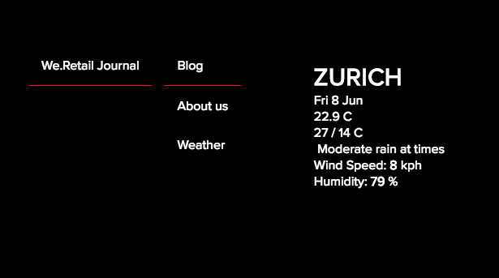
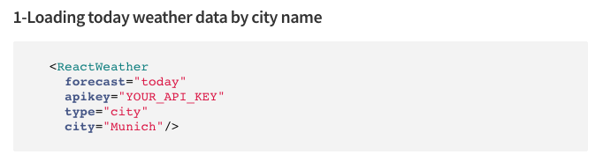

# 为 SPA 实施 React 组件{#implementing-a-react-component-for-spa}

单页应用程序 (SPA) 可以为网站用户提供引人入胜的良好体验。为此，开发人员希望能够使用SPA框架构建站点，而创作者则希望能够在Adobe Experience Manager (AEM)中顺畅地为使用SPA框架构建的站点编辑内容。

SPA创作功能提供了一个全面的解决方案，用于在AEM中支持SPA。 本文介绍了如何调整简单的现有React组件以用于AEM SPA编辑器的示例。

{{ue-over-spa}}

## 简介 {#introduction}

由于AEM需要并在SPA和SPA编辑器之间建立的简单且轻量的合同，在AEM中使用现有JavaScript应用程序并调整它以用于SPA是一件简单的事情。

本文说明了We.Retail Journal示例SPA上的天气组件示例。

在阅读本文之前，您应该熟悉AEM[&#128279;](/help/sites-developing/spa-getting-started-react.md)的SPA应用程序的结构。

>[!CAUTION]
>本文档仅将[We.Retail Journal应用程序](https://github.com/adobe/aem-sample-we-retail-journal)用于演示目的。 请勿将其用于任何项目工作。
>
>任何 AEM 项目都应使用 [AEM 项目原型](https://experienceleague.adobe.com/docs/experience-manager-core-components/using/developing/archetype/overview.html?lang=zh-Hans)，它支持使用 React 或 Angular 的 SPA 项目并利用 SPA SDK。

## 天气组件 {#the-weather-component}

天气组件在We.Retail Journal应用程序的左上角找到。 它显示定义位置的当前天气，动态提取天气数据。

### 使用天气小组件 {#using-the-weather-widget}


在SPA编辑器中创作SPA内容时，天气组件显示为任何其他AEM组件，在工具栏中完成并且可编辑。


城市可以在对话框中更新，就像任何其他AEM组件一样。


更改将持续存在，并且组件会自动使用新天气数据更新自身。



### 天气组件实施 {#weather-component-implementation}

天气组件基于公开可用的React组件，名为[React Open Weather](https://www.npmjs.com/package/react-open-weather)。 它已被修改为可作为We.Retail Journal示例SPA应用程序中的组件使用。

以下是React Open Weather组件用法的NPM文档片段。

 

查看We.Retail日志应用程序中自定义的天气组件(`Weather.js`)的代码：

* **行16**：根据需要加载React Open Weather构件。
* **第46**&#x200B;行： `MapTo`函数将此React组件与相应的AEM组件相关联，以便在SPA编辑器中编辑它。

* **行22-29**：定义了`EditConfig`，检查是否已填充城市，如果为空，则定义值。

* **行31-44**：天气组件扩展`Component`类，并按照React Open Weather组件的NPM使用文档中的定义提供所需数据并呈现该组件。

```javascript
/*~~~~~~~~~~~~~~~~~~~~~~~~~~~~~~~~~~~~~~~~~~~~~~~~~~~~~~~~~~~~~~~~~~~~~~~~~~~~~~
 ~ Copyright 2018 Adobe Systems Incorporated
 ~
 ~ Licensed under the Apache License, Version 2.0 (the "License");
 ~ you may not use this file except in compliance with the License.
 ~ You may obtain a copy of the License at
 ~
 ~     https://www.apache.org/licenses/LICENSE-2.0
 ~
 ~ Unless required by applicable law or agreed to in writing, software
 ~ distributed under the License is distributed on an "AS IS" BASIS,
 ~ WITHOUT WARRANTIES OR CONDITIONS OF ANY KIND, either express or implied.
 ~ See the License for the specific language governing permissions and
 ~ limitations under the License.
 ~~~~~~~~~~~~~~~~~~~~~~~~~~~~~~~~~~~~~~~~~~~~~~~~~~~~~~~~~~~~~~~~~~~~~~~~~~~~~*/
import React, {Component} from 'react';
import ReactWeather from 'react-open-weather';
import {MapTo} from '@adobe/aem-react-editable-components';

require('./Weather.css');

const WeatherEditConfig = {

    emptyLabel: 'Weather',

    isEmpty: function() {
        return !this.props || !this.props.cq_model || !this.props.cq_model.city || this.props.cq_model.city.trim().length < 1;
    }
};

class Weather extends Component {

    render() {
        let apiKey = "12345678901234567890";
        let city;

        if (this.props.cq_model) {
            city = this.props.cq_model.city;
            return <ReactWeather key={'react-weather' + Date.now()} forecast="today" apikey={apiKey} type="city" city={city} />
        }

        return null;
    }
}

MapTo('we-retail-journal/global/components/weather')(Weather, WeatherEditConfig);
```

虽然后端组件必须已存在，但前端开发人员可以使用We.Retail Journal SPA中的React Open Weather组件，并且只需很少的编码。

## 后续步骤 {#next-step}

有关为AEM开发SPA的更多信息，请参阅文章[为AEM开发SPA](/help/sites-developing/spa-architecture.md)。
