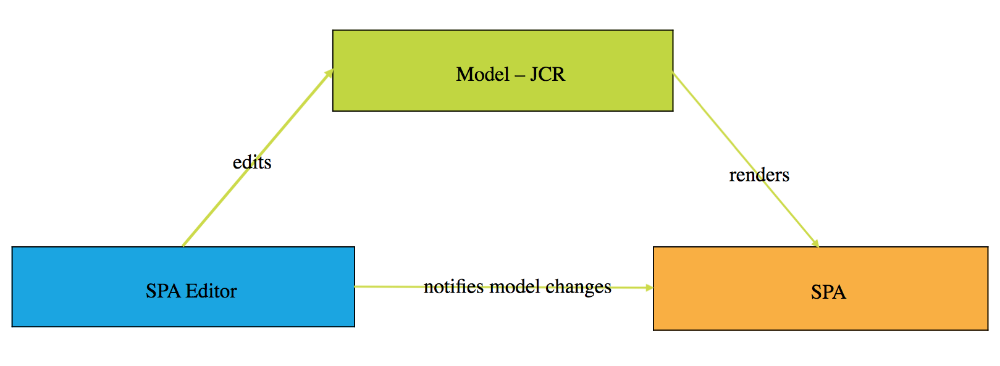

# SPA编辑器概述{#spa-editor-overview}

单页应用程序(SPA)可以为网站用户提供引人入胜的体验。 开发人员希望能够使用SPA框架构建站点，而作者希望在AEM中为使用此框架构建的站点无缝编辑内容。

SPA编辑器为在AEM中支持SPA提供了全面的解决方案。 本页概述了SPA支持在AEM中的结构、SPA编辑器的工作方式以及SPA框架和AEM保持同步的方式。

>[!NOTE]
>
>对于需要基于SPA框架的客户端渲染（例如“反应”或“角度”）的项目，建议使用SPA编辑器解决方案。

## 简介 {#introduction}

使用通用SPA框架（如React和Angular）构建的站点通过动态JSON加载其内容，并且不提供AEM页面编辑器能够放置编辑控件所必需的HTML结构。

要在AEM中编辑SPA，需要SPA的JSON输出与AEM存储库中的内容模型之间的映射，以保存对内容所做的更改。

AEM中的SPA支持引入了一个精简JS层，当该层加载到页面编辑器中时，可通过该层发送事件并激活编辑控件的位置以允许进行上下文内编辑。 此功能基于Content Services API端点概念，因为SPA中的内容需要通过Content services加载。

有关AEM中SPA的更多详细信息，请参阅以下文档：

* [SPA Blueprint](/help/sites-developing/spa-blueprint.md) ，用于满足SPA的技术要求
* [AEM中的SPA快速入门](/help/sites-developing/spa-getting-started-react.md) ，快速浏览简单的SPA

## 设计 {#design}

SPA的页面组件不通过JSP或HTL文件提供其子组件的HTML元素。 此操作委托给SPA框架。 子组件或模型的表示形式从JCR中作为JSON数据结构获取。 然后，SPA组件会根据该结构添加到页面。 此行为将页面组件的初始主体构成与非SPA组件区分开来。

### 页面模型管理 {#page-model-management}

页面模型的解析和管理被委托给提供的库 `PageModel` 。 SPA必须使用页面模型库才能进行初始化并由SPA编辑器创作。 通过npm间接提供给AEM页面组件的页面模型 `cq-react-editable-components` 库。 页面模型是AEM和SPA之间的解释器，因此必须始终存在。 创作页面时，必须添加一 `cq.authoring.pagemodel.messaging` 个额外的库才能启用与页面编辑器的通信。

如果SPA页面组件从页面核心组件继承，则有两个选项可以使客户端库类 `cq.authoring.pagemodel.messaging` 别可用：

* 如果模板是可编辑的，请将其添加到页面策略。
* 或使用添加类别 `customfooterlibs.html`。

对于导出模型中的每个资源，SPA将映射一个实际的组件，以执行渲染。 然后，使用容器中的组件映射来呈现表示为JSON的模型。

>[!CAUTION]
>
>列入该类 `cq.authoring.pagemodel.messaging` 别应仅限于SPA编辑器的上下文。

### 通信数据类型 {#communication-data-type}

将类 `cq.authoring.pagemodel.messaging` 别添加到页面时，它将向页面编辑器发送消息以建立JSON通信数据类型。 当通信数据类型设置为JSON时，GET请求将与组件的Sling model端点通信。 在页面编辑器中进行更新后，更新组件的JSON表示形式将发送到页面模型库。 页面模型库随后会通知SPA更新。

## 工作流 {#workflow}

您可以将SPA编辑器视为SPA和AEM之间的调解者，从而了解SPA与AEM之间的交互流程。

* 页面编辑器与SPA之间的通信是使用JSON而不是HTML进行的。
* 页面编辑器通过iframe和消息传递API向SPA提供最新版本的页面模型。
* 页面模型管理器会通知编辑者已准备好进行编辑，并将页面模型作为JSON结构传递。
* 编辑器不会更改或甚至访问所创作页面的DOM结构，而是提供最新的页面模型。

### 基本SPA编辑器工作流程 {#basic-spa-editor-workflow}

请记住SPA编辑器的关键元素，创作者可以按如下方式查看在AEM中编辑SPA的高级工作流。

1. 加载SPA编辑器。
1. SPA加载在单独的框架中。
1. SPA请求JSON内容并在客户端呈现组件。
1. SPA编辑器可检测渲染的组件并生成叠加。
1. 创作者单击叠加，显示组件的编辑工具栏。
1. SPA编辑器通过向服务器发出POST请求来继续进行编辑。
1. SPA编辑器向SPA编辑器请求更新的JSON,SPA编辑器将通过DOM事件发送到SPA。
1. SPA会重新呈现相关组件，并更新其DOM。

>[!NOTE]
>
>记住：
>
>* SPA总是负责其展示。
>* SPA编辑器与SPA本身隔离。
>* 在生产（发布）中，SPA编辑器从未加载。
>

### 客户端——服务器页面编辑工作流 {#client-server-page-editing-workflow}

这是编辑SPA时客户端与服务器交互的更详细概述。

1. SPA将自行初始化，并从Sling Model Exporter请求页面模型。
1. Sling Model Exporter从存储库请求组成页面的资源。
1. 存储库会返回资源。
1. Sling Model Exporter将返回页面的模型。
1. SPA根据页面模型实例化其组件。
1. **6a** ，内容会通知编辑者已准备好进行创作。

   **6b** ，页面编辑器请求组件创作配置。

   **6c** ，页面编辑器接收组件配置。
1. 当作者编辑组件时，页面编辑器会将修改请求发布到默认的POST servlet。
1. 资源会在存储库中更新。
1. 更新的资源将提供给POST servlet。
1. 默认的POST servlet通知页面编辑器资源已更新。
1. 页面编辑器会请求新的页面模型。
1. 系统会从存储库请求构成页面的资源。
1. 构成页面的资源由存储库提供给Sling Model Exporter。
1. 更新的页面模型将返回到编辑器。
1. 页面编辑器会更新SPA的页面模型参考。
1. SPA会根据新的页面模型参考更新其组件。
1. 页面编辑器的组件配置将更新。

   **17a** SPA向页面编辑器发出内容准备就绪的信号。

   **17b页面编辑器** 为SPA提供组件配置。

   **17c** SPA提供更新的组件配置。

### 创作工作流 {#authoring-workflow}

这是更详细的概述，重点介绍创作体验。

1. SPA获取页面模型。
1. **2a页面模型** 为编辑者提供了创作所需的数据。

   **2b** ，当收到通知时，component orchestrator会更新页面的内容结构。
1. 组件Orchestrator查询AEM资源类型与SPA组件之间的映射。
1. 组件管理器基于页面模型和组件映射动态地实例化SPA组件。
1. 页面编辑器会更新页面模型。
1. **6a页面模型** 为页面编辑器提供了更新的创作数据。

   **6b** page model将更改调度到component orchestrator。
1. 组件Orchestrator获取组件映射。
1. component orchestrator会更新页面内容。
1. 当SPA完成更新页面内容时，页面编辑器将加载创作环境。

## 要求和限制 {#requirements-limitations}

要使作者能够使用页面编辑器编辑SPA的内容，必须实施您的SPA应用程序才能与AEM SPA Editor SDK交互。 请参阅AEM [文档中的SPA快速入门](/help/sites-developing/spa-getting-started-react.md) ，了解让您的SPA运行所需的最低要求。

### 支持的框架 {#supported-frameworks}

SPA Editor SDK支持以下最低版本：

* React 16.3
* 角形6.x

这些框架的先前版本可能与AEM SPA Editor SDK一起使用，但不支持。

### 其他框架 {#additional-frameworks}

可以实施其他SPA框架以与AEM SPA Editor SDK一起使用。 请参阅  SPA Blueprint文档，了解框架创建框架特定层时必须满足的要求，该层由模块、组件和服务组成，以便与AEM SPA Editor一起使用。

### 限制 {#limitations}

AEM SPA Editor SDK是随AEM 6.4 Service Pack 2一起引入的。 Adobe完全支持它，并且作为一项新功能，它将继续得到增强和扩展。 SPA编辑器尚不支持以下AEM功能：

* 目标模式
* ContextHub
* 内联图像编辑
* 编辑配置(例如 监听器)
* 样式系统
* 撤消／重做
* 页面差异和时间扭曲
* 执行HTML重写服务器端的功能，如链接检查器、CDN重写服务、URL缩短等。
* 开发人员模式
* AEM启动项
