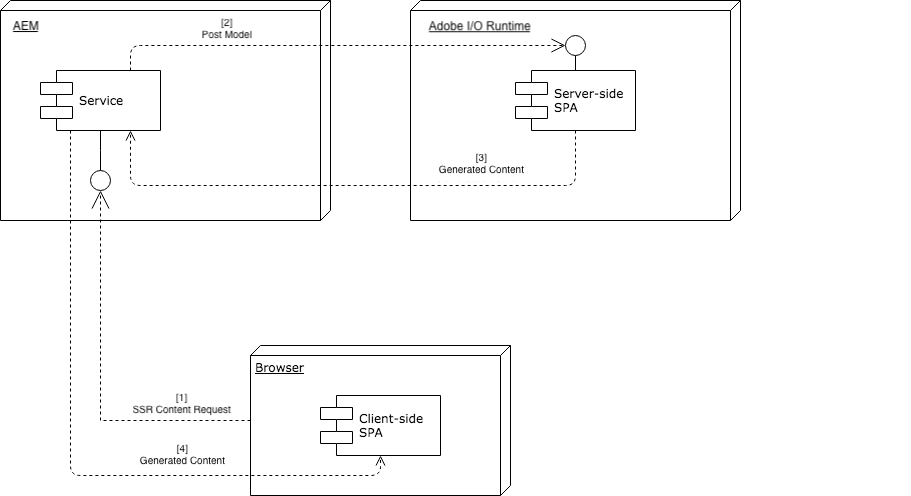

# SPA和服务器端渲染{#spa-and-server-side-rendering}

>[!NOTE]
>
>对于需要基于SPA框架的客户端渲染（例如“反应”或“角度”）的项目，建议使用SPA编辑器解决方案。

>[!NOTE]
>
>需要AEM 6.5.1.0或更高版本才能使用本文档中所述的SPA服务器端渲染功能。

## 概述 {#overview}

单页应用程序(SPA)可以为用户优惠丰富的动态体验，这种体验以熟悉的方式反应和行为，通常就像本机应用程序一样。 [这是通过依赖客户端预先加载内容，然后进行处理用户交互的繁重工作来实现的](/help/sites-developing/spa-walkthrough.md#how-does-a-spa-work) ，从而最小化客户端和服务器之间需要的通信量，使应用更加被动。

但是，这可能导致较长的初始加载时间，尤其是当SPA较大且内容丰富时。 为了优化加载时间，某些内容可在服务器端呈现。 使用服务器端渲染(SSR)可以加快页面的初始加载，然后将进一步的渲染传递给客户端。

## 何时使用SSR {#when-to-use-ssr}

并非所有项目都需要SSR。 Althgouh AEM完全支持SPA的JS SSR,Adobe不建议对每个项目系统地实施它。

在决定实施SSR时，首先要估计SSR的实际代价，包括长期维护，SSR的额外复杂度、工作量和成本增加。 SSR结构的选择只有当增加值明显超过估计成本时。

SSR通常在以下任一问题有明确的“是”时提供一些值：

* **SEO:** SSR是否仍然需要SSR才能由带来流量的搜索引擎正确索引？ 请记住，主搜索引擎爬虫程序现在会评估JS。
* **页面速度：** SSR是否提供了可衡量的实际环境速度提升，并增加了整体用户体验？

只有在这两个问题中至少有一个得到明确的“是”回答时，Adobe才建议实施SSR。 以下各节介绍如何使用Adobe I/O Runtime实现此操作。

## Adobe I/O Runtime {#adobe-i-o-runtime}

如果您 [确信您的项目需要实施SSR](/help/sites-developing/spa-ssr.md#when-to-use-ssr)，则Adobe建议的解决方案是使用Adobe I/O Runtime。

有关Adobe I/O Runtime的更多信息，请参阅

* [https://www.adobe.io/apis/experienceplatform/runtime.html](https://www.adobe.io/apis/experienceplatform/runtime.html) —— 有关服务的概述
* [https://www.adobe.io/apis/experienceplatform/runtime/docs.html](https://www.adobe.io/apis/experienceplatform/runtime/docs.html) —— 有关该平台的详细文档

以下各节详细介绍了如何使用Adobe I/O Runtime在两种不同的模型中为您的SPA实施SSR:

* [AEM驱动的通信流](/help/sites-developing/spa-ssr.md#aem-driven-communication-flow)
* [Adobe I/O运行时驱动的通信流](/help/sites-developing/spa-ssr.md#adobe-i-o-runtime-driven-communication-flow)

>[!NOTE]
>
>Adobe建议为每个AEM环境（创作、发布、舞台等）使用单独的Adobe I/O Runtime实例。

## 远程渲染器配置 {#remote-renderer-configuration}

AEM必须知道可在何处检索远程渲染的内容。 无论您 [选择为SSR实现哪种模式，](#adobe-i-o-runtime) 都需要指定AEM如何访问此远程渲染服务。

这是通过RemoteContentRenderer - Configuration Factory OSGi服 **务完成的**。 在“Web控制台配置”控制台中搜索字符串“RemoteContentRenderer”(位于 `http://<host>:<port>/system/console/configMgr`)。


以下字段可用于配置：

* **内容路径模式** -根据需要进行常规表达式以匹配部分内容
* **远程端点URL** —— 负责生成内容的端点的URL
   * 如果不在本地网络中，请使用安全的HTTPS协议。
* **其他请求标头** -要添加到发送到远程端点的请求的其他标头
   * 图案： `key=value`
* **请求超时** -远程主机请求超时（以毫秒为单位）

>[!NOTE]
>
>无论您选择实施 [AEM驱动的通信流或](#aem-driven-communication-flow) Adobe I/O Runtime驱动的流 [](#adobe-i-o-runtime-driven-communication-flow) ，都必须定义远程内容渲染器配置。
>
>如果您选择使用自定义Node.js服 [务器，则必须定义此配置。](#using-node-js)

>[!NOTE]
>
>此配置利用远程 [内容渲染器](#remote-content-renderer) ，该渲染器还提供其他扩展和自定义选项。

## AEM驱动的通信流 {#aem-driven-communication-flow}

使用SSR时，AEM中 [](/help/sites-developing/spa-overview.md#workflow) SPA的组件交互工作流程包括在Adobe I/O Runtime上生成应用程序初始内容的阶段。

1. 浏览器从AEM请求SSR内容。

1. AEM将模型发布到Adobe I/O Runtime。

1. Adobe I/O Runtime返回生成的内容。

1. AEM通过后端页面组件的HTL模板为Adobe I/O Runtime返回的HTML提供服务。



## Adobe I/O运行时驱动的通信流 {#adobe-i-o-runtime-driven-communication-flow}

上一节介绍了与AEM中的SPA相关的服务器端渲染的标准实施和建议实施，AEM在AEM中执行内容的引导和服务。

或者，SSR可以实现，这样Adobe I/O Runtime负责引导，有效地逆转了通信流。

两种型号均有效，且受AEM支持。 但是，在实施特定模型之前，应该考虑每个模型的优缺点。

<table>
 <tbody>
  <tr>
   <th><strong>引导</strong></th>
   <th><strong>优势</strong></th>
   <th><strong>缺点</strong></th>
  </tr>
  <tr>
   <th><strong>通过AEM</strong><br /> </th>
   <td>
    <ul>
     <li>AEM根据需要管理注入库</li>
     <li>只需在AEM上维护资源<br /> </li>
    </ul> </td>
   <td>
    <ul>
     <li>SPA开发人员可能不熟悉<br /> </li>
    </ul> </td>
  </tr>
  <tr>
   <th><strong>通过Adobe I/O Runtime<br /> </strong></th>
   <td>
    <ul>
     <li>SPA开发人员更熟悉<br /> </li>
    </ul> </td>
   <td>
    <ul>
     <li>AEM开发人员需要通过属性使应用程序（如CSS和JavaScript）所需的Clientlib资源可 <code><a href="/help/sites-developing/clientlibs.md#locating-a-client-library-folder-and-using-the-proxy-client-libraries-servlet">allowProxy</a></code> 用<br /> </li>
     <li>必须在AEM和Adobe I/O Runtime之间同步资源<br /> </li>
     <li>要启用SPA的创作，可能需要Adobe I/O Runtime的代理服务器</li>
    </ul> </td>
  </tr>
 </tbody>
</table>

## SSR规划 {#planning-for-ssr}

通常，只需在服务器端呈现应用程序的一部分。 通用示例是呈现服务器端时，将在页面初始加载时折叠上方显示的内容。 这通过将已呈现的内容交付到客户端来节省时间。 当用户与SPA交互时，客户端将呈现其他内容。

在考虑为SPA实施服务器端渲染时，您需要查看应用程序的哪些部分是必需的。

## 用SSR开发SPA {#developing-an-spa-using-ssr}

SPA组件可由客户端（在浏览器中）或服务器端呈现。 呈现服务器端时，浏览器属性（如窗口大小和位置）不存在。 因此，SPA组件应是同构的，不要假设它们将呈现在何处。

要利用SSR，您需要在AEM以及负责服务器端渲染的Adobe I/O Runtime上部署代码。 大多数代码将相同，但特定于服务器的任务将不同。

## AEM中SPA的SSR {#ssr-for-spas-in-aem}

AEM中SPA的SSR需要Adobe I/O Runtime，这用于渲染应用程序内容服务器端。 在应用程序的HTL中，将调用Adobe I/O Runtime上的资源来呈现内容。

正如AEM支持Angular和React SPA框架即装即用，Angular和React应用程序也支持服务器端渲染。 有关更多详细信息，请参阅两个框架的NPM文档。

* 反应： [https://github.com/adobe/aem-sample-we-retail-journal/blob/master/react-app/DEVELOPMENT.md#enabling-the-server-side-rendering-using-the-aem-page-component](https://github.com/adobe/aem-sample-we-retail-journal/blob/master/react-app/DEVELOPMENT.md#enabling-the-server-side-rendering-using-the-aem-page-component)
* 角度： [https://github.com/adobe/aem-sample-we-retail-journal/blob/master/react-app/DEVELOPMENT.md#enabling-the-server-side-rendering-using-the-aem-page-component](https://github.com/adobe/aem-sample-we-retail-journal/blob/master/react-app/DEVELOPMENT.md#enabling-the-server-side-rendering-using-the-aem-page-component)

有关简单化的示例，请参阅 [We.Retail日志应用程序](https://github.com/Adobe-Marketing-Cloud/aem-sample-we-retail-journal)。 它呈现整个应用程序服务器端。 虽然这不是一个真实的例子，但它确实说明了实现SSR所需要的。

>[!CAUTION]
>
>We. [Retail日志应用程序仅用于演示目的](https://github.com/Adobe-Marketing-Cloud/aem-sample-we-retail-journal) ，因此将Node.js用作一个简单示例，而不是推荐的Adobe I/O Runtime。 此示例不应用于任何项目工作。

>[!NOTE]
>
>AEM上的所有SPA项目应基于 [Maven Archetype for SPA Starter Kit](https://github.com/adobe/aem-spa-project-archetype)。

## 使用Node.js {#using-node-js}

Adobe I/O Runtime是在AEM中为SPA实施SSR的推荐解决方案。

对于预置AEM实例，也可以像上述那样使用自定义Node.js实例实现SSR。 尽管Adobe支持此功能，但不建议这样做。

>[!NOTE]
>
>Adobe托管的AEM实例不支持Node.js。

>[!NOTE]
>
>如果必须通过Node.js实现SSR,Adobe建议为每个AEM环境（作者、发布、舞台等）提供一个单独的Node.js实例。

## 远程内容渲染器 {#remote-content-renderer}

在AEM [中将SSR与您的SPA一起使用时需要的远程内容渲染器配置](#remote-content-renderer-configuration) ，可利用更广义的渲染服务进行扩展和自定义，以满足您的需求。

### RemoteContentRenderingService {#remotecontentrenderingservice}

`RemoteContentRenderingService` 是一项OSGi服务，用于检索在远程服务器上呈现的内容，如从Adobe I/O中呈现的内容。发送到远程服务器的内容基于传递的请求参数。

`RemoteContentRenderingService` 当需要额外的内容处理时，可通过依赖性反转注入到自定义Sling模型或servlet中。

此服务由 [RemoteContentRendererRequestHandlerServlet内部使用](#remotecontentrendererrequesthandlerservlet)。

### RemoteContentRendererRequestHandlerServlet {#remotecontentrendererrequesthandlerservlet}

可以 `RemoteContentRendererRequestHandlerServlet` 使用它以编程方式设置请求配置。 `DefaultRemoteContentRendererRequestHandlerImpl`提供的默认请求处理程序实现允许您创建多个OSGi配置，以便将内容结构中的位置映射到远程端点。

要添加自定义请求处理程序，请实现该 `RemoteContentRendererRequestHandler` 接口。 请务必将组 `Constants.SERVICE_RANKING` 件属性设置为大于100的整数，它是组件的排名 `DefaultRemoteContentRendererRequestHandlerImpl`。

```
@Component(immediate = true,
        service = RemoteContentRendererRequestHandler.class,
        property={
            Constants.SERVICE_RANKING +":Integer=1000"
        })
public class CustomRemoteContentRendererRequestHandlerImpl implements RemoteContentRendererRequestHandler {}
```

### 配置默认处理函数的OSGi配置 {#configure-default-handler}

必须按照“远程内容渲染器配置”部分中的说明配置默 [认处理程序的配置](#remote-content-renderer-configuration)。

### 远程内容渲染器使用情况 {#usage}

要让Servlet获取并返回某些可插入页面的内容，请执行以下操作：

1. 确保远程服务器可访问。
1. 将以下代码片段之一添加到AEM组件的HTL模板。
1. （可选）创建或修改OSGi配置。
1. 浏览站点内容

通常，页面组件的HTL模板是此类功能的主要收件人。

```
<sly data-sly-resource="${resource @ resourceType='cq/remote/content/renderer/request/handler'}" />
```

### 要求 {#requirements}

Servlet利用Sling Model Exporter对组件数据进行序列化。 默认情况下，和 `com.adobe.cq.export.json.ContainerExporter` 都支 `com.adobe.cq.export.json.ComponentExporter` 持Sling Model适配器。 如有必要，您可以添加类，请求应调整为使用和 `RemoteContentRendererServlet` 实现类 `RemoteContentRendererRequestHandler#getSlingModelAdapterClasses`。 其他类必须扩展 `ComponentExporter`。
