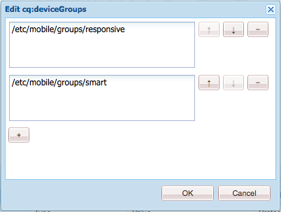
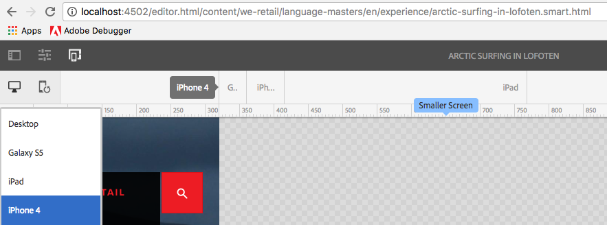

# 自适应模板渲染{#adaptive-template-rendering}

自适应模板渲染提供了一种管理具有变体的页面的方法。 这项功能最初对于为移动设备提供各种HTML输出很有用（例如，功能手机与智能电话），但在需要将体验交付到需要不同标记或HTML输出的各种设备时，这项功能非常有用。

## 概述 {#overview}

模板是围绕响应式网格构建的，基于这些模板创建的页面具有完全响应式，可自动调整以符合客户端设备的视区。 使用页面编辑器中的模拟器工具栏，作者可以将布局定位到特定设备。

也可以设置模板来支持自适应渲染。 正确配置设备组后，在模拟器模式下选择设备时，页面将通过URL中的其他选择器呈现。 使用选择器，可通过URL直接调用特定页面渲染。

设置设备组时请记住：

* 每个设备必须至少位于一个设备组中。
* 一个设备可以位于多个设备组中。
* 由于设备可以位于多个设备组中，因此可以组合选择器。
* 选择器组合在存储库中持久保留时会自上而下评估。

>[!NOTE]
>
>设备组**响应式设备从不具有选择器，因为假定被识别为支持响应式设计的设备不需要自适应布局

## 配置 {#configuration}

可以为现有设备组或您自己创建的[组配置自适应渲染选择器。](/help/sites-developing/mobile.md#device-groups)

对于此示例，您将配置现有的设备组&#x200B;**智能手机**，使其在We.Retail中的&#x200B;**体验页面**&#x200B;模板中包含自适应渲染选择器。

1. 在`http://localhost:4502/miscadmin#/etc/mobile/groups`中编辑需要自适应选择器的设备组

   设置选项&#x200B;**禁用模拟器**&#x200B;并保存。

   

1. 选择器可用于&#x200B;**BlackBerry®**&#x200B;和&#x200B;**iPhone 4**，前提是按以下步骤将设备组&#x200B;**Smartphone**&#x200B;添加到模板和页面结构。

   

1. 使用CRXDE Lite，通过将设备组添加到模板结构上的多值字符串属性`cq:deviceGroups`中，允许在模板上使用设备组。

   `/conf/<your-site>/settings/wcm/templates/<your-template>/structure/jcr:content`

   例如，如果要添加Smartphone设备组：

   `/conf/we-retail/settings/wcm/templates/experience-page/structure/jcr:content`

   

1. 使用CRXDE Lite，通过将设备组添加到网站结构上的多值字符串属性`cq:deviceGroups`中，允许在网站上使用该设备组。

   `/content/<your-site>/jcr:content`

   例如，如果要允许&#x200B;**智能手机**&#x200B;设备组：

   `/content/we-retail/jcr:content`

   

现在，在页面编辑器中使用[模拟器](/help/sites-authoring/responsive-layout.md#layout-definitions-device-emulation-and-breakpoints)时（例如，在[修改布局](/help/sites-authoring/responsive-layout.md)时），当您选择已配置设备组的某个设备时，页面将作为URL的一部分呈现为选择器。

在此示例中，在编辑基于&#x200B;**Experience Page**&#x200B;模板的页面，并在模拟器中选择iPhone 4时，该页面将呈现为`arctic-surfing-in-lofoten.smart.html`，而不是`arctic-surfing-in-lofoten.html`

也可以使用此选择器直接调用页面。

