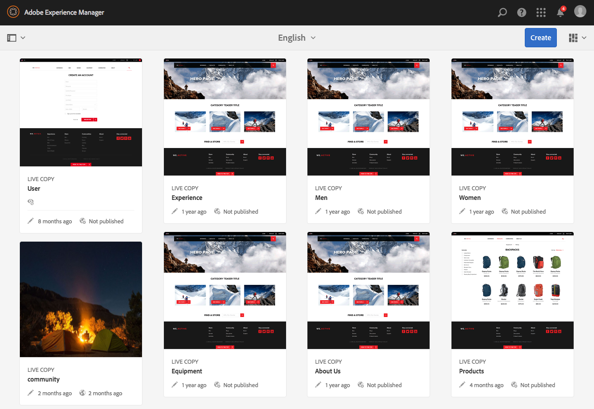

# AEM觸控式UI的概念{#concepts-of-the-aem-touch-enabled-ui}

AEM提供觸控式UI，具有 [回應式設計](/help/sites-authoring/responsive-layout.md) 適用於專為觸控和桌上型電腦裝置設計的製作環境。

>[!NOTE]
>
>觸控式UI是AEM的標準UI。 AEM 6.4已棄用傳統UI。

觸控式UI包含：

* 套裝標題：
   * 顯示標誌
   * 提供全域導覽的連結
   * 提供其他一般動作的連結；例如「搜尋」、「說明」、「Marketing Cloud解決方案」、「通知」和「使用者設定」。
* 左側邊欄（需要時顯示，可隱藏），其中可顯示：
   * 时间线
   * 引用
   * 过滤器
* 導覽標頭，同樣是內容感應式，可顯示：
   * 指出您目前使用哪個主控台和/或您在主控台中的位置
   * 左側邊欄的選取專案
   * 痕迹导航
   * 存取適當的 **建立** 動作
   * 檢視選取專案
* 內容區域：
   * 列出內容專案（無論是頁面、資產、論壇帖子等）
   * 可依要求格式化，例如欄、卡片或清單
   * 使用回應式設計（顯示器會根據您的裝置和/或視窗大小自動調整大小）
   * 使用無限捲動（不再分頁，所有專案會列在一個視窗中）



>[!NOTE]
>
>幾乎所有的AEM功能都已移植至觸控式UI。 但在某些有限的情況下，功能將會恢復為傳統UI。 另請參閱 [觸控式UI功能狀態](/help/release-notes/touch-ui-features-status.md) 以取得詳細資訊。

Adobe將觸控式UI設計為可跨多個產品提供一致的使用者體驗。 其依據為：

* **Coral UI** (CUI)針對觸控式UI實作Adobe的視覺樣式。 Coral UI提供產品/專案/Web應用程式採用UI視覺樣式所需的一切。
* **Granite UI** 元件是使用Coral UI建置。

觸控式UI的基本原則為：

* 行動優先（以桌上型電腦為考量）
* 回應式設計
* 內容相關顯示
* 可重複使用
* 包含內嵌參考檔案
* 包含內嵌測試
* 由下而上的設計，以確保這些原則套用至每個元素和元件

如需觸控式UI結構的詳細概觀，請參閱文章 [AEM觸控式UI的結構](/help/sites-developing/touch-ui-structure.md).

## AEM技術棧疊 {#aem-technology-stack}

AEM以Granite平台為基礎，Granite平台包含Java內容存放庫等。


## Granite {#granite}

Granite是Adobe的Open Web棧疊，提供各種元件，包括：

* 應用程式啟動器
* 部署所有專案的OSGi框架
* 支援建置應用程式的多項OSGi簡編服務
* 提供各種記錄API的完整記錄架構
* JCR API規格的CRX存放庫實作
* Apache Sling Web架構
* 目前CRX產品的其他部分

>[!NOTE]
>
>Granite是在Adobe中以開放開發專案的方式執行：對程式碼的貢獻、討論和問題來自整個公司。
>
>不過，Granite是 **not** 開放原始碼專案。 它在很大程度上基於幾個開放原始碼專案（尤其是Apache Sling、Felix、Jackrabbit和Lucene），但Adobe在公開和內部之間畫出了清晰的界線。

## Granite UI {#granite-ui}

Granite工程平台也提供基礎UI架構。 其主要目標是：

* 提供精細的UI Widget
* 實施UI概念並說明最佳實務（長清單呈現、清單篩選、物件CRUD、CUD精靈……）
* 提供可擴充且以外掛程式為基礎的管理UI

這些均符合下列要求：

* 尊重「行動優先」
* 可擴充
* 易於覆寫


GraniteUI.pdf

[取得檔案](assets/graniteui.pdf)
Granite UI：

* 使用Sling的RESTful架構
* 實作元件程式庫，用於建置以內容為中心的網頁應用程式
* 提供精細的UI Widget
* 提供預設的標準化UI
* 可擴充
* 專為行動裝置和桌上型裝置所設計（首先考慮行動裝置）
* 可用於任何以Granite為基礎的平台/產品/專案；例如AEM


* [Granite UI Foundation元件](#granite-ui-foundation-components)
此基礎元件程式庫可供其他程式庫使用或擴充。
* [Granite UI管理元件](#granite-ui-administration-components)

### 使用者端與伺服器端 {#client-side-vs-server-side}

Granite UI中的使用者端 — 伺服器通訊是由超文字組成，而不是物件，因此使用者端不需要瞭解商業邏輯

* 伺服器使用語意資料豐富HTML
* 使用者端利用超媒體（互動）豐富超文字


#### 使用者端 {#client-side}

這會使用HTML辭彙的擴充功能，讓作者可以表達建立互動式網頁應用程式的意圖。 這是類似的方法 [WAI-ARIA](https://www.w3.org/TR/wai-aria/) 和 [微格式](https://microformats.org/).

它主要由使用者端上執行的JS和CSS程式碼所解譯的互動模式（例如，非同步提交表單）集合組成。 使用者端的角色是增強互動標籤（由伺服器指定為超媒體可供使用）。

使用者端不受任何伺服器技術限制。 只要伺服器提供適當的標籤，使用者端就可以完成其角色。

目前JS和CSS程式碼會以Granite傳送 [clientlibs](/help/sites-developing/clientlibs.md) 在類別底下：

`granite.ui.foundation and granite.ui.foundation.admin`

這些會作為內容套件的一部分提供：

`granite.ui.content`

#### 伺服器端 {#server-side}

這是由Sling元件的集合所組成，可讓作者執行以下動作： *撰寫* Webapp快速。 開發人員會開發元件，而作者會將元件組合成網頁應用程式。 伺服器端的角色是為使用者端提供Hypermedia可供性（標籤）。

目前，元件位於Granite存放庫中：

`/libs/granite/ui/components/foundation`

這會作為內容套件的一部分提供：

`granite.ui.content`

### 與傳統UI的差異 {#differences-with-the-classic-ui}

Granite UI和ExtJS （用於傳統UI）之間的差異也值得關注：

<table>
 <tbody>
  <tr>
   <td><strong>ExtJS</strong></td>
   <td><strong>Granite UI</strong></td>
  </tr>
  <tr>
   <td>遠端程式呼叫<br /> </td>
   <td>狀態轉換</td>
  </tr>
  <tr>
   <td>資料傳輸物件</td>
   <td>Hypermedia</td>
  </tr>
  <tr>
   <td>使用者端知道伺服器內部</td>
   <td>使用者端不知道內部網路</td>
  </tr>
  <tr>
   <td>"胖使用者端"</td>
   <td>「精簡型使用者端」</td>
  </tr>
  <tr>
   <td>專門的使用者端資料庫</td>
   <td>通用使用者端資料庫</td>
  </tr>
 </tbody>
</table>

### Granite UI Foundation元件 {#granite-ui-foundation-components}

此 [Granite UI基礎元件](https://helpx.adobe.com/experience-manager/6-5/sites/developing/using/reference-materials/granite-ui/api/jcr_root/libs/granite/ui/index.html) 提供建置任何UI所需的基本建置組塊。 其中包括：

* 按钮
* 超链接
* 用户头像

基礎元件可在下列位置找到：

`/libs/granite/ui/components/foundation`

此程式庫包含每個Coral元素的Granite UI元件。 元件為內容導向，其設定位於存放庫中。 如此一來，您便無需手動撰寫HTML標籤，即可撰寫Granite UI應用程式。

用途:

* HTML元素的元件模型
* 元件組合
* 自動單元與功能測試

实施:

* 以存放庫為基礎的構成和設定
* 運用Granite平台提供的測試設施
* JSP範本

此基礎元件程式庫可供其他程式庫使用或擴充。

### ExtJS和對應的Granite UI元件 {#extjs-and-corresponding-granite-ui-components}

升級ExtJS程式碼以使用Granite UI時，下列清單提供ExtJS xtypes和節點型別及其等效Granite UI資源型別的便利概覽。

| **ExtJS xtype** | **Granite UI資源型別** |
|---|---|
| `button` | `granite/ui/components/foundation/form/button` |
| `checkbox` | `granite/ui/components/foundation/form/checkbox` |
| `componentstyles` | `cq/gui/components/authoring/dialog/componentstyles` |
| `cqinclude` | `granite/ui/components/foundation/include` |
| `datetime` | `granite/ui/components/foundation/form/datepicker` |
| `dialogfieldset` | `granite/ui/components/foundation/form/fieldset` |
| `hidden` | `granite/ui/components/foundation/form/hidden` |
| `html5smartfile, html5smartimage` | `granite/ui/components/foundation/form/fileupload` |
| `multifield` | `granite/ui/components/foundation/form/multifield` |
| `numberfield` | `granite/ui/components/foundation/form/numberfield` |
| `pathfield, paragraphreference` | `granite/ui/components/foundation/form/pathbrowser` |
| `selection` | `granite/ui/components/foundation/form/select` |
| `sizefield` | `cq/gui/components/authoring/dialog/sizefield` |
| `tags` | `granite/ui/components/foundation/form/autocomplete``cq/gui/components/common/datasources/tags` |
| `textarea` | `granite/ui/components/foundation/form/textarea` |
| `textfield` | `granite/ui/components/foundation/form/textfield` |

| **節點型別** | **Granite UI資源型別** |
|---|---|
| `cq:WidgetCollection` | `granite/ui/components/foundation/container` |
| `cq:TabPanel` | `granite/ui/components/foundation/container``granite/ui/components/foundation/layouts/tabs` |
| `cq:panel` | `granite/ui/components/foundation/container` |

### Granite UI管理元件 {#granite-ui-administration-components}

此 [Granite UI管理元件](https://helpx.adobe.com/experience-manager/6-5/sites/developing/using/reference-materials/granite-ui/api/jcr_root/libs/granite/ui/index.html) 建置在foundation元件上，以提供任何管理應用程式皆可實作的一般建置區塊。 其中包括：

* 全域導覽列
* 邊欄（骨架）
* 搜尋面板

用途:

* 統一的管理應用程式外觀
* 管理應用程式的RAD

实施:

* 使用基礎元件的預先定義元件
* 元件可自訂

## Coral UI {#coral-ui}

CoralUI.pdf

[取得檔案](assets/coralui.pdf)
Coral UI (CUI)是觸控式UI的Adobe視覺樣式實作，其設計旨在為多個產品的使用者體驗提供一致性。 Coral UI提供您採用製作環境所使用的視覺樣式所需的一切。

>[!CAUTION]
>
>Coral UI是一種UI程式庫，可供AEM客戶在其授權使用產品的範圍內建置應用程式和Web介面。
>
>僅允許使用Coral UI：
>
>
>* 當它出貨並與AEM捆綁時。
>* 用於擴充編寫環境的現有UI時。
>* Adobe企業附屬資料、廣告和簡報。
>* Adobe品牌應用程式的UI （字型不可隨時用於其他用途）。
>* 進行微幅自訂。
>
>應避免在以下位置使用Coral UI：
>
>* 與Adobe無關的檔案和其他專案。
>* 內容建立環境（前述專案可能由其他人產生）。
>* 未明確連線至Adobe的應用程式/元件/網頁。
>


Coral UI是開發Web應用程式的建置區塊集合。


每個模組從一開始就是模組化的，根據其主要角色而形成不同的層。 雖然這些圖層的設計目的是要相互支援，但可視需要獨立使用。 如此一來，您就可以在任何具備HTML功能的環境中實作Coral的使用者體驗。

使用Coral UI時，不必使用特定的開發模型和/或平台。 Coral的主要目標是提供統一且乾淨的HTML5標籤，與用來發出此標籤的實際方法無關。 這可用於使用者端或伺服器端轉譯、範本、JSP、PHP或甚至AdobeFlashRIA應用程式 — 僅舉幾例。

### HTML元素 — 標籤層 {#html-elements-the-markup-layer}

HTML元素為所有基本UI元素（包括導覽列、按鈕、功能表、邊欄等）提供共同的外觀。

在最基本的層級，HTML元素是具有專用類別名稱的HTML標籤。 更複雜的元素可由多個標籤組成，彼此巢狀（以特定方式）。

CSS用於提供實際的外觀。 為了能夠輕鬆自訂外觀（例如品牌化），實際樣式值會宣告為變數，並由 [更少](https://lesscss.org/) 執行期間的前置處理器。

用途:

* 提供具有共同外觀的基本使用者介面元素
* 提供預設格點系統

实施:

* HTML標籤及其靈感來自於 [啟動程式](https://twitter.github.com/bootstrap/)
* 類別是在LESS檔案中定義
* 圖示定義為字型拼字

例如，標籤：

```xml
<button class="btn btn-large btn-primary" type="button">Large button</button>
<button class="btn btn-large" type="button">Large button</button>
```

顯示為：


外觀和感覺在LESS中定義，以專屬類別名稱繫結至元素（為了簡短起見，已縮短下列擷取）：

```xml
.btn {
    font-size: @baseFontSize;
    line-height: @baseLineHeight;
    .buttonBackground(@btnBackground,
                                @btnBackgroundHighlight,
                                @grayDark, 0 1px 1px rgba(255,255,255,.75));
```

實際值是在LESS變數檔案中定義（為了簡潔起見，已縮短下列擷取）：

```xml
@btnBackgroundHighlight: darken(@white, 10%);
@btnPrimaryBackgroundHighlight: spin(@btnPrimaryBackground, 20%);
@baseFontSize: 17px;
@baseFontFamily: @sansFontFamily;
```

### 元素外掛程式 {#element-plugins}

許多HTML元素將需要表現出某種動態行為，例如開啟和關閉彈出式選單。 這是元素外掛程式的角色，可透過使用JavaScript操控DOM來完成這類工作。

外掛程式為：

* 專為操作特定DOM元素而設計。 例如，對話外掛程式預期會找到 `DIV class=dialog`
* 本質上是通用的。 例如，版面配置管理員可為任何清單提供版面 `DIV` 或 `LI` 元素

外掛程式行為可使用引數自訂，方法如下：

* 透過JavaScript呼叫傳遞引數
* 使用專用的 `data-*` 與HTML標籤繫結的屬性

雖然開發人員可以為任何外掛程式選取最佳方法，但經驗法則是使用：

* `data-*` 與HTML配置相關之選項的屬性。 例如，指定欄數
* 與資料相關功能的API選項/類別。 例如，建構要顯示的專案清單

實施表單驗證時也會使用相同的概念。 對於要驗證的元素，您必須將所需的輸入表單指定為自訂 `data-*` 屬性。 然後，此屬性會作為驗證外掛程式的選項。

>[!NOTE]
>
>應儘可能使用HTML5原生表單驗證並/或加以擴充。

用途:

* 為HTML元素提供動態行為
* 提供純CSS所不能的自訂版面配置
* 執行表單驗證
* 執行進階DOM操作

实施:

* jQuery外掛程式，繫結至特定DOM元素
* 使用 `data-*` 自訂行為的屬性

範例標籤的擷取(請注意指定為資料的選項 — &#42; attributes)：

```xml
<ul data-column-width="220" data-layout="card" class="cards">
  <li class="item">
    <div class="thumbnail">
      
      <div class="caption">
        <h4>Toolbar</h4>
          <p><small>toolbar</small><br></p>
      </div>
    </div>
  </li>
  <li class="item">
    <div class="thumbnail">
      
      <div class="caption">
        <h4>Toolbar</h4>
        <p><small>toolbar</small><br></p>
      </div>
    </div>
  </li>
```

對jQuery外掛程式的呼叫：

```
$(‘.cards’).cardlayout ();
```

這會顯示為：


此 `cardLayout` 外掛程式會以括住的形式 `UL` 根據元素各自的高度並考慮父項的寬度。

### HTML元素Widget {#html-elements-widgets}

Widget會將一或多個基本元素與JavaScript外掛程式結合，以形成「較高層級」的UI元素。 這些元素可以實作比單一元素所能提供的更複雜的行為，以及更複雜的外觀和感覺。 標籤選擇器或邊欄Widget是很好的範例。

Widget可以觸發並監聽自訂事件，以便與頁面上的其他Widget合作。 某些Widget實際上是使用CoralHTML元素的原生jQuery Widget。

用途:

* 實作展現複雜行為的較高層級UI元素
* 觸發及處理事件

实施:

* jQuery外掛程式+HTML標籤
* 可以利用使用者端/伺服器端範本

範例標籤為：

```
<input type="text" name="tags" placeholder="Tags" class="tagManager"/>
```

對jQuery外掛程式的呼叫（含選項）：

```
$(".tagManager").tagsManager({
        prefilled: ["Pisa", "Rome"] })
```

外掛程式會發出HTML標籤（此標籤會使用基本元素，這些元素可能在內部使用其他外掛程式）：

```
<span>Pisa</code>
<a title="Removing tag" tagidtoremove="0"
   id="myRemover_0" class="myTagRemover" href="#">x</a></code>

<span id="myTag_1" class="myTag"><span>Rome</code>
<a title="Removing tag" tagidtoremove="1"
   id="myRemover_1" class="myTagRemover" href="#">x</a></code>

<input type="text" data-original-title="" class="input-medium tagManager"
       placeholder="Tags" name="tags" data-provide="typeahead" data-items="6"
       autocomplete="off">
```

這會顯示為：


### 公用程式庫 {#utility-library}

此程式庫是以下JavaScript輔助外掛程式和/或函式的集合：

* 獨立於UI
* 然而，這對於建立完整功能的網頁應用程式至關重要

其中包括XSS處理和事件匯流排。

雖然HTML元素外掛程式和Widget可能依賴公用程式庫提供的功能，但公用程式庫無法硬性依賴元素或Widget本身。

用途:

* 提供通用功能
* 事件匯流排實作
* 使用者端範本
* XSS

实施:

* jQuery外掛程式或符合AMD規範的JavaScript模組
