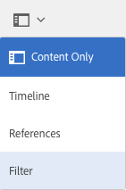

# AEM触屏优化UI的结构{#structure-of-the-aem-touch-enabled-ui}

AEM触屏优化UI具有多个基本原则，由几个关键元素组成：

## 控制台 {#consoles}

### 基本布局和调整大小 {#basic-layout-and-resizing}

UI适合移动和桌面设备，但Adobe决定使用一种适用于所有屏幕和设备的样式，而不是创建两种样式。

所有模块都使用相同的基本布局，在AEM中，这可以看作：

该布局采用响应式设计样式，并且会根据您所使用的设备／窗口的大小调整自己。

例如，当分辨率低于1024px（与移动设备一样）时，显示屏将相应地调整：

### 标题栏 {#header-bar}

标题栏显示全局元素，包括：

* 徽标和您当前使用的特定产品／解决方案；对于AEM，这也构成了指向全局导航的链接
* 搜索
* 用于访问帮助资源的图标
* 用于访问其他解决方案的图标
* 指示（并访问）等待您发送的任何警报或收件箱项目
* 用户图标，以及指向您的个人资料管理的链接

### 工具栏 {#toolbar}

这与您的位置和表面工具相关，与控制下面页面中的视图或资产相关。 工具栏特定于产品，但元素有一些通用性。

在任何位置，工具栏都会显示当前可用的操作：

还取决于当前是否选择了某个资源：

### 左边栏 {#left-rail}

可以根据需要打开／隐藏左边栏以显示：

* **时间轴**
* **引用**
* **筛选器**

默认为仅 **限内容** （边栏隐藏）。

## 页面创作 {#page-authoring}

创作页面时，结构区域如下所示。

### 内容框架 {#content-frame}

页面内容会呈现在内容框架中。 内容框架完全独立于编辑器——确保不会因CSS或javascript而发生冲突。

内容框架位于窗口的右侧部分工具栏下。

### 编辑器框架 {#editor-frame}

编辑器框架实现了编辑功能。

编辑器框架是所有页面创作元素的容器( *摘要)*。 它位于内容框架的顶部，包括：

* 顶部工具栏
* 侧面板
* 所有叠加
* 任何其他页面创作元素；例如，组件工具栏

### 侧面板 {#side-panel}

其中包含两个默认选项卡，允许您选择资产和组件；它们可以从此处拖动到页面上。

侧面板默认为隐藏。 选择后，窗口将显示在左侧，或者滑过来覆盖整个窗口(当窗口大小低于1024像素的宽度时；例如，在移动设备上)。

### 侧面板——资源 {#side-panel-assets}

在“资产”选项卡中，您可以从资产范围中进行选择。 您还可以按特定术语进行筛选，或选择组。

### 侧面板——资产组 {#side-panel-asset-groups}

在资产选项卡中，您可以使用下拉列表选择特定的资产组。

### 侧面板——组件 {#side-panel-components}

在组件选项卡中，您可以从组件范围中进行选择。 您还可以按特定术语进行筛选，或选择组。

### 叠加 {#overlays}

这些组件叠加在内容框架上，并由图层使 [用](#layer) ，以了解如何与组件及其内容（完全透明）交互。

叠加位于编辑器框架中（与所有其他页面创作元素一起），但实际上它们叠加了内容框架中的相应组件。

### 图层 {#layer}

图层是可激活的独立功能束，用于：

* 提供页面的不同视图
* 允许您操作页面和／或与页面交互

这些图层为整个页面提供了复杂的功能，而不是单个组件上的特定操作。

AEM附带几个已用于页面创作的图层；包括编辑、预览、注释等。

>[!NOTE]
>
>图层是一个强大的概念，它影响用户对页面内容的视图以及与页面内容的交互。 在开发您自己的图层时，您需要确保该图层在退出时清理干净。

### 图层切换器 {#layer-switcher}

图层切换器允许您选择要使用的图层。 关闭时，它指示当前使用的图层。

图层切换器可从工具栏（位于窗口顶部，位于编辑器框架中）中作为下拉菜单。

### 组件工具栏 {#component-toolbar}

单击组件的每个实例时，都会显示其工具栏（单击一次或慢速双击）。 工具栏包含特定操作（例如，复制、粘贴、打开编辑器），这些操作对页面上的组件实例（可编辑）可用。

根据可用空间，组件工具栏位于相应组件的右上角或右下角。

## 更多信息 {#further-information}

有关触屏优化UI概念的更多详细信息，请继续阅读 [AEM触屏优化UI的概念文章](/help/sites-developing/touch-ui-concepts.md)。

有关更多技术信息，请参 [阅适用于触屏优化页面编辑器的](https://helpx.adobe.com/experience-manager/6-5/sites/developing/using/reference-materials/jsdoc/ui-touch/editor-core/index.html) JS文档集。

