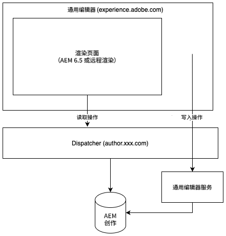

# 通用编辑器 {#universal-editor}

了解通用编辑器的灵活性，以及它如何帮助您使用AEM 6.5增强Headless体验。

## 概述 {#overview}

通用编辑器是一个通用的可视化编辑器，它是Adobe Experience Manager Sites的一部分。 它使作者能够对任何Headless体验进行“所见即所得”(WYSIWYG)编辑。

* 由于通用编辑器对所有形式的AEM Headless内容支持相同的一致可视化编辑，因此作者可从通用编辑器的灵活性中获益。
* 开发人员受益于通用编辑器的多功能性，因为它也支持实施之间的真正分离。 它允许开发人员利用他们选择的几乎任何框架或体系结构，而不施加任何SDK或技术限制。

有关更多详细信息，请参阅通用编辑器[&#128279;](https://experienceleague.adobe.com/zh-hans/docs/experience-manager-cloud-service/content/implementing/developing/universal-editor/introduction)上的AEM as a Cloud Service文档。

## 架构 {#architecture}

Universal Editor是一项与AEM配合使用的服务，用于无头创作内容。

* 通用编辑器托管在`https://experience.adobe.com/#/aem/editor/canvas`，可以编辑AEM 6.5渲染的页面。
* AEM页面由通用编辑器通过Dispatcher从AEM创作实例读取。
* 与Dispatcher在同一主机上运行的通用编辑器服务会将更改写回AEM创作实例。



## 要求 {#requirements}

以下内容支持通用编辑器：

* AEM 6.5（Service Pack 21或22以及功能包）
   * 支持内部部署和AMS托管。
* [AEM as a Cloud Service](https://experienceleague.adobe.com/zh-hans/docs/experience-manager-cloud-service/content/implementing/developing/universal-editor/introduction)（版本`2023.8.13099`或更高版本）

本文档重点介绍对通用编辑器的AEM 6.5支持。

## 设置 {#setup}

要测试通用编辑器，您需要：

1. [更新和配置您的AEM创作实例。](#update-configure-aem)
1. [设置本地通用编辑器服务。](#set-up-ue)
1. [调整您的Dispatcher以允许Universal Editor服务。](#update-dispatcher)

完成设置后，您可以[检测应用程序以使用通用编辑器。](#instrumentation)

### 更新AEM {#update-aem}

要将通用编辑器与AEM 6.5结合使用，需要AEM的Service Pack 21或22以及功能包。

#### 应用最新的Service Pack {#latest}

确保您至少运行的是AEM 6.5的Service Pack 21或22。您可以从[Software Distribution.](https://experienceleague.adobe.com/docs/experience-cloud/software-distribution/home.html)下载最新的Service Pack

#### 安装通用编辑器功能包 {#feature-pack}

安装Software Distribution上提供的适用于AEM 6.5 **[的**&#x200B;通用编辑器功能包。](https://experience.adobe.com/#/downloads/content/software-distribution/en/aem.html?package=/content/software-distribution/en/details.html/content/dam/aem/public/cq-6.5.21-universal-editor-1.0.0.zip)

如果您已经在运行Service Pack 23或更高版本，则不需要使用该功能包。

### 配置服务 {#configure-services}

功能包会安装大量需要额外配置的新包。

#### 为`login-token` Cookie设置SameSite属性。 {#samesite-attribute}

1. 打开Configuration Manager。
   * `http://<host>:<port>/system/console/configMgr`
1. 在列表中找到&#x200B;**Adobe Granite令牌身份验证处理程序**，然后单击&#x200B;**更改配置值**。
1. 在对话框中，将登录令牌Cookie **(`token.samesite.cookie.attr`)值的** SameSite属性更改为`Partitioned`。
1. 单击&#x200B;**保存**。

#### 删除`SAMEORIGIN`标头X-Frame选项。 {#sameorigin}

1. 打开Configuration Manager。
   * `http://<host>:<port>/system/console/configMgr`
1. 在列表中找到&#x200B;**Apache Sling主Servlet**，然后单击&#x200B;**编辑配置值**。
1. 从&#x200B;**其他响应标头**&#x200B;属性(`sling.additional.response.headers`)中删除`X-Frame-Options=SAMEORIGIN`值（如果存在）。
1. 单击&#x200B;**保存**。

#### 配置Adobe Granite查询参数身份验证处理程序。 {#query-parameter}

1. 打开Configuration Manager。
   * `http://<host>:<port>/system/console/configMgr`
1. 在列表中找到&#x200B;**Adobe Granite查询参数身份验证处理程序**，然后单击&#x200B;**编辑配置值**。
1. 在&#x200B;**路径**&#x200B;字段(`path`)中，添加要启用的`/`。
   * 空值将禁用身份验证处理程序。
1. 单击&#x200B;**保存**。

#### 定义应为其打开内容路径或`sling:resourceTypes`通用编辑器。 {#paths}

1. 打开Configuration Manager。
   * `http://<host>:<port>/system/console/configMgr`
1. 在列表中找到&#x200B;**通用编辑器URL服务**，然后单击&#x200B;**编辑配置值**。
1. 定义应为其打开内容路径或`sling:resourceTypes`通用编辑器。
   * 在&#x200B;**Universal Editor Opening Mapping**&#x200B;字段中，提供打开Universal Editor的路径。
   * 在应由通用编辑器打开的&#x200B;**Sling：resourceTypes**&#x200B;字段中，提供由通用编辑器直接打开的资源的列表。
1. 单击&#x200B;**保存**。
1. 检查您的[外部化器配置](/help/sites-developing/externalizer.md)，并确保至少已按照以下示例设置本地、作者和发布环境。

   ```text
   "local $[env:AEM_EXTERNALIZER_LOCAL;default=http://localhost:4502]",
   "author $[env:AEM_EXTERNALIZER_AUTHOR;default=http://localhost:4502]",
   "publish $[env:AEM_EXTERNALIZER_PUBLISH;default=http://localhost:4503]"
   ```

完成这些配置步骤后，AEM将按以下顺序打开页面的通用编辑器。

1. AEM将检查`Universal Editor Opening Mapping`下的映射，如果内容位于该处定义的任何路径下，则将为其打开通用编辑器。
1. 对于不在`Universal Editor Opening Mapping`中定义的路径下的内容，AEM会检查内容的`resourceType`是否与&#x200B;**Sling：resourceTypes中定义的那些内容匹配，这些类型应由通用编辑器打开**，如果内容与其中一种类型匹配，则在`${author}${path}.html`处为其打开通用编辑器。
1. 否则，AEM将打开页面编辑器。

以下变量可用于定义`Universal Editor Opening Mapping`下的映射。

* `path`：要打开的资源的内容路径
* `localhost`： `localhost`的Externalizer项没有架构，如`localhost:4502`
* `author`：没有架构的作者的Externalizer条目，如`localhost:4502`
* `publish`：用于无架构的发布的外部化器条目，如`localhost:4503`
* `preview`：用于预览的外部化器项，不带架构，如`localhost:4504`
* `env`： `prod`、`stage`、`dev`基于定义的Sling运行模式
* `token`： `QueryTokenAuthenticationHandler`所需的查询令牌

映射示例：

* 在AEM作者的`/content/foo`下打开所有页面：
   * `/content/foo:${author}${path}.html?login-token=${token}`
   * 这会导致打开`https://localhost:4502/content/foo/x.html?login-token=<token>`
* 在远程NextJS服务器上打开`/content/bar`下的所有页面，提供所有变量作为信息
   * `/content/bar:nextjs.server${path}?env=${env}&author=https://${author}&publish=https://${publish}&login-token=${token}`
   * 这会导致打开`https://nextjs.server/content/bar/x?env=prod&author=https://localhost:4502&publish=https://localhost:4503&login-token=<token>`

### 设置通用编辑器服务 {#set-up-ue}

更新并配置AEM后，您可以设置本地通用编辑器服务，用于您自己的本地开发和测试。

1. 安装Node.js版本>=20。
1. 从[Software Distribution](https://experienceleague.adobe.com/en/docs/experience-cloud/software-distribution/home)下载并解压缩最新的通用编辑器服务
1. 通过环境变量或`.env`文件配置通用编辑器服务。
   * [有关详细信息，请参阅AEM as a Cloud Service通用编辑器文档。](https://experienceleague.adobe.com/en/docs/experience-manager-cloud-service/content/implementing/developing/universal-editor/local-dev#setting-up-service)
   * 请注意，如果需要内部IP重写，您可能需要使用`UES_MAPPING`选项。
1. 运行`universal-editor-service.cjs`

### 更新Dispatcher {#update-dispatcher}

如果配置了AEM并且运行了本地Universal Editor服务，则需要在Dispatcher中允许新服务[的反向代理。](https://experienceleague.adobe.com/zh-hans/docs/experience-manager-dispatcher/using/dispatcher)

1. 调整创作实例的vhost文件以包含反向代理。

   ```html
   <IfModule mod_proxy.c>
    ProxyPass "/universal-editor" "http://localhost:8080"
    ProxyPassReverse "/universal-editor" "http://localhost:8080"
   </IfModule>
   ```

   >[!NOTE]
   >
   >8080是默认端口。 如果您使用[您的`.env`文件](https://experienceleague.adobe.com/en/docs/experience-manager-cloud-service/content/implementing/developing/universal-editor/local-dev#setting-up-service)中的`UES_PORT`参数更改了此设置，则必须相应地调整此处的端口值。

1. 重新启动Apache。

## 检测您的应用程序 {#instrumentation}

更新了AEM并运行了本地通用编辑器服务后，您就可以使用通用编辑器开始编辑Headless内容。

但是，必须检测您的应用程序才能利用通用编辑器。 这包括包含元标记以指示编辑器如何以及在何处保留内容。 此检测程序的详细信息可在AEM as a Cloud Service的[通用编辑器文档中找到。](https://experienceleague.adobe.com/en/docs/experience-manager-cloud-service/content/implementing/developing/universal-editor/getting-started#instrument-page)

请注意，如果遵循AEM as a Cloud Service通用编辑器的相关文档，则在将其与AEM 6.5一起使用时将会应用以下更改。

* Meta标记中的协议必须为`aem65`而不是`aem`。

  ```html
  <meta name="urn:adobe:aue:system:aemconnection" content={`aem65:${getAuthorHost()}`}/>
  ```

* 通用编辑器服务端点必须通过meta标记公告。

  ```html
  <meta name="urn:adobe:aue:config:service" content={`${getAuthorHost()}/universal-editor`}/>
  ```

* 在组件定义的`plugins`部分中，必须使用`aem65`而不是`aem`。

>[!TIP]
>
>有关开发人员通用编辑器快速入门的综合指南，请参阅AEM as a Cloud Service文档中的[AEM开发人员通用编辑器概述](https://experienceleague.adobe.com/en/docs/experience-manager-cloud-service/content/implementing/developing/universal-editor/developer-overview)，同时请牢记本节中提到的AEM 6.5支持所需的必要更改。

## AEM 6.5与AEM as a Cloud Service之间的差异 {#differences}

AEM 6.5中的通用编辑器与AEM as a Cloud Service中的通用编辑器工作方式大致相同，包括UI和大部分设置。 然而，应当注意的是存在差异。

* 6.5中的通用编辑器仅支持Headless用例。
* 通用编辑器的设置对6.5略有不同（[，如当前文档中所述](#setup)）。
* 6.5中的通用编辑器使用与AEM as a Cloud Service不同的资产选取器和内容片段选取器。
