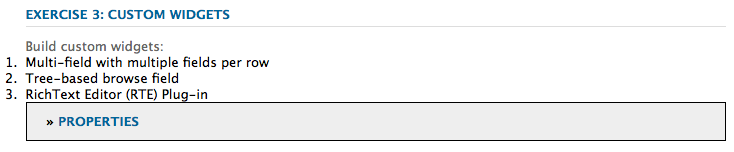
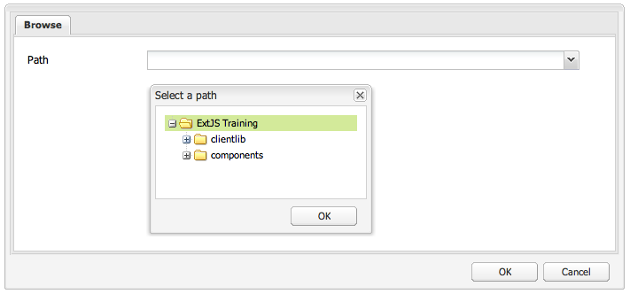

# 使用和扩展小组件（经典UI）{#using-and-extending-widgets-classic-ui}

>[!NOTE]
>
>本页介绍经典UI中构件的使用，AEM 6.4已弃用该构件。
>
>Adobe建议您使用基于[Coral UI](/help/sites-developing/touch-ui-concepts.md#coral-ui)和[Granite UI](/help/sites-developing/touch-ui-concepts.md#granite-ui-foundation-components)的现代[触屏UI](/help/sites-developing/touch-ui-concepts.md)。

Adobe Experience Manager (AEM)基于Web的界面使用AJAX和其他现代浏览器技术，支持作者在网页上通过WYSIWYG编辑和格式化内容。

AEM使用[ExtJS](https://www.sencha.com/)构件库，该库提供了在所有最重要的浏览器中工作的高度抛光的用户界面元素，并允许创建桌面级的UI体验。

这些构件包含在AEM中，除了AEM本身的使用之外，还可以由使用AEM构建的任何网站使用。

有关AEM中所有可用小组件的完整参考，请参阅[小组件API文档](https://developer.adobe.com/experience-manager/reference-materials/6-5/widgets-api/index.html)或现有xtypes](/help/sites-developing/xtypes.md)的[列表。 此外，框架的所有者[Sencha](https://examples.sencha.com/extjs/7.6.0/)网站上提供了许多说明如何使用ExtJS框架的示例。

本页提供了有关如何使用和扩展构件的某些见解。 它首先介绍如何在页面](#including-the-client-sided-code-in-a-page)中[包含客户端代码。 然后，它描述了一些已创建的示例组件，以说明一些基本用法和扩展。 这些组件在&#x200B;**包共享**&#x200B;上的&#x200B;**使用ExtJS小组件**&#x200B;包中可用。

此包中包含以下示例：

* [基本对话框](#basic-dialogs)使用现成的构件生成。
* [动态对话框](#dynamic-dialogs)使用现成的构件和自定义的JavaScript逻辑生成。
* 基于[自定义小组件](#custom-widgets)的对话框。
* [树面板](#tree-overview)在给定路径下显示JCR树。
* 以表格格式显示数据的[网格面板](#grid-overview)。

>[!NOTE]
>
>Adobe Experience Manager的经典UI基于[ExtJS 3.4.0](https://extjs.cachefly.net/ext-3.4.0/docs/)构建。

## 在页面中包含客户端代码 {#including-the-client-sided-code-in-a-page}

客户端端的JavaScript和样式表代码应放置在客户端库中。

要创建客户端库，请执行以下操作：

1. 在`/apps/<project>`下创建具有以下属性的节点：

   * name=&quot;clientlib&quot;
   * jcr：mixinTypes=&quot;[mix：lockable]&quot;
   * jcr：primaryType=&quot;cq：ClientLibraryFolder&quot;
   * sling：resourceType=&quot;widgets/clientlib&quot;
   * categories=&quot;[&lt;类别名称>]&quot;
   * dependencies=&quot;[cq.widgets]&quot;

   `Note: <category-name> is the name of the custom library (for example, "cq.extjstraining") and is used to include the library on the page.`

1. 在`clientlib`下创建`css`和`js`文件夹(nt：folder)。

1. 在`clientlib`下创建`css.txt`和`js.txt`文件(nt：files)。 这些.txt文件列出库中包含的文件。

1. 编辑`js.txt`：必须以“`#base=js`”开头，后跟CQ客户端库服务聚合的文件列表，例如：

   ```
   #base=js
    components.js
    exercises.js
    CustomWidget.js
    CustomBrowseField.js
    InsertTextPlugin.js
   ```

1. 编辑`css.txt`：必须以“`#base=css`”开头，后跟CQ客户端库服务聚合的文件列表，例如：

   ```
   #base=css
    components.css
   ```

1. 在`js`文件夹下，放置属于库的JavaScript文件。

1. 在`css`文件夹下方，放置`.css`文件和css文件使用的资源（例如，`my_icon.png`）。

>[!NOTE]
>
>之前描述的样式表的处理是可选的。

要在页面组件jsp中包含客户端库，请执行以下操作：

* 要同时包含JavaScript代码和样式表，请执行以下操作：
  `<ui:includeClientLib categories="<category-name1>, <category-name2>, ..."/>`
其中`<category-nameX>`是客户端库的名称。

* 要仅包含JavaScript代码，请执行以下操作：
  `<ui:includeClientLib js="<category-name>"/>`

有关详细信息，请参阅标记的说明 [&lt;ui:includeClientLib>](/help/sites-developing/taglib.md#lt-ui-includeclientlib) 。&lt;/ui:includeClientLib>

有时，客户端库应仅在创作模式下可用，而在发布模式下应排除。 可以按如下方式实现：

```xml
    if (WCMMode.fromRequest(request) != WCMMode.DISABLED) {
        %><ui:includeClientLib categories="cq.collab.blog"/><%
    }
```

### 示例快速入门 {#getting-started-with-the-samples}

要遵循此页面上的教程，请在本地AEM实例中安装包&#x200B;**使用ExtJS小组件**，并创建一个包含组件的示例页面。 为此，请执行以下操作：

1. 在AEM实例中，从包共享下载名为&#x200B;**使用ExtJS小组件(v01)**&#x200B;的包并安装该包。 它在存储库中创建位于`/apps`下的项目`extjstraining`。
1. 将包含脚本(js)和样式表(css)的客户端库包含在Geometrixx页jsp的head标记中。 您即将在&#x200B;**Geometrixx**分支的新页面中包含示例组件：
在**CRXDE Lite**&#x200B;中，打开文件`/apps/geometrixx/components/page/headlibs.jsp`并将`cq.extjstraining`类别添加到现有`<ui:includeClientLib>`标记中，如下所示：
   `%><ui:includeClientLib categories="apps.geometrixx-main, cq.extjstraining"/><%`
1. 在`/content/geometrixx/en/products`下方的&#x200B;**Geometrixx**&#x200B;分支中创建页面，并使用ExtJS小组件&#x200B;**调用它**。
1. 进入设计模式，并将名为&#x200B;**使用ExtJS小组件**&#x200B;的组的所有组件添加到Geometrixx的设计中
1. 返回编辑模式：Sidekick中提供&#x200B;**使用ExtJS小组件**&#x200B;的组。

>[!NOTE]
>
>此页面上的示例基于Geometrixx示例内容，该内容不再随AEM一起提供，已被We.Retail取代。 有关如何下载和安装Geometrixx，请参阅[We.Retail参考实现](/help/sites-developing/we-retail.md#we-retail-geometrixx)。

### 基本对话框 {#basic-dialogs}

对话框通常用于编辑内容，但也可以显示信息。 查看完整对话框的一个简单方法是以json格式访问其表示形式。 为此，请将浏览器指向：

`https://localhost:4502/<path-to-dialog>.-1.json`

Sidekick中&#x200B;**使用ExtJS小组件**&#x200B;组的第一个组件名为&#x200B;**1。 对话框基础知识**&#x200B;并包括四个使用现成小组件构建且没有自定义JavaScript逻辑的基本对话框。 对话框存储在`/apps/extjstraining/components/dialogbasics`下。 基本对话框包括：

* 完整对话框（`full`节点）：它显示一个带有三个选项卡的窗口，每个选项卡都有两个文本字段。
* 单面板对话框（`singlepanel`节点）：它显示一个窗口，其中包含一个选项卡，该选项卡具有两个文本字段。
* 多面板对话框（`multipanel`节点）：其显示与“完整”对话框相同，但构建方式不同。
* “设计”对话框（`design`节点）：它显示一个带有两个选项卡的窗口。 第一个选项卡具有文本字段、下拉菜单和可折叠文本区域。 第二个选项卡有一个包含四个文本字段的字段集和一个包含两个文本字段的可折叠字段集。

包括&#x200B;**1。 示例页面中的对话框基础知识**&#x200B;组件：

1. 添加&#x200B;**1。 从** Sidekick **中的**&#x200B;使用ExtJS小组件&#x200B;**选项卡将对话框基础知识**&#x200B;组件添加到示例页面。
1. 该组件显示标题、某些文本和&#x200B;**属性**&#x200B;链接。 选择该链接将显示存储在存储库中的段落的属性。 再次选择链接可隐藏属性。

该组件显示如下：


#### 示例1：完整对话框 {#example-full-dialog}

**完整**&#x200B;对话框显示一个窗口，其中包含三个选项卡，每个选项卡都有两个文本字段。 这是&#x200B;**对话框基础知识**&#x200B;组件的默认对话框。 其特点是：

* 由节点定义：节点类型= `cq:Dialog`，xtype = ` [dialog](/help/sites-developing/xtypes.md#dialog)`。
* 显示三个选项卡（节点类型= `cq:Panel`）。
* 每个选项卡都有两个文本字段（节点类型= `cq:Widget`，xtype = ` [textfield](/help/sites-developing/xtypes.md#textfield)`）。
* 由节点定义：
  `/apps/extjstraining/components/dialogbasics/full`
* 通过请求以JSON格式呈现：
  `https://localhost:4502/apps/extjstraining/components/dialogbasics/full.-1.json`

该对话框显示如下：


#### 示例2：单面板对话框 {#example-single-panel-dialog}

**单面板**&#x200B;对话框显示一个窗口，其中有一个选项卡具有两个文本字段。 其特点是：

* 显示一个选项卡（节点类型= `cq:Dialog`，xtype = ` [panel](/help/sites-developing/xtypes.md#panel)`）
* 该选项卡有两个文本字段（节点类型= `cq:Widget`，xtype = ` [textfield](/help/sites-developing/xtypes.md#textfield)`）
* 由节点定义：
  `/apps/extjstraining/components/dialogbasics/singlepanel`
* 通过请求以json格式呈现：
  `https://localhost:4502/apps/extjstraining/components/dialogbasics/singlepanel.-1.json`
* 与&#x200B;**完整对话框**&#x200B;相比，它的一个优点是所需的配置更少。
* 建议使用：用于显示信息或只有几个字段的简单对话框。

要使用单面板对话框，请执行以下操作：

1. 将&#x200B;**对话框基础知识**&#x200B;组件的对话框替换为&#x200B;**单面板**&#x200B;对话框：
   1. 在&#x200B;**CRXDE Lite**&#x200B;中，删除节点： `/apps/extjstraining/components/dialogbasics/dialog`
   1. 单击&#x200B;**全部保存**&#x200B;以保存更改。
   1. 复制节点： `/apps/extjstraining/components/dialogbasics/singlepanel`
   1. 将复制的节点粘贴到下方： `/apps/extjstraining/components/dialogbasics`
   1. 选择节点`/apps/extjstraining/components/dialogbasics/Copy of singlepanel`并将其重命名`dialog`。
1. 编辑组件：对话框显示如下：


#### 示例3：多面板对话框 {#example-multi-panel-dialog}

**多面板**&#x200B;对话框与&#x200B;**完整**&#x200B;对话框具有相同的显示，但其构建方式不同。 其特点是：

* 由节点定义（节点类型= `cq:Dialog`，xtype = ` [tabpanel](/help/sites-developing/xtypes.md#tabpanel)`）。
* 显示三个选项卡（节点类型 = `cq:Panel`）。
* 每个选项卡有两个文本字段（节点类型 = `cq:Widget`， xtype = ` [textfield](/help/sites-developing/xtypes.md#textfield)`）。
* 由节点定义：
  `/apps/extjstraining/components/dialogbasics/multipanel`
* 通过请求以json格式呈现：
  `https://localhost:4502/apps/extjstraining/components/dialogbasics/multipanel.-1.json`
* 与&#x200B;**完整对话框**&#x200B;相比，其优点之一是结构简化。
* 建议使用：用于多选项卡对话框。

要使用“多面板”对话框，请执行以下操作：

1. 将&#x200B;**对话框基础知识**&#x200B;组件的对话框替换为&#x200B;**多面板**对话框：
按照为[示例2：单面板对话框](#example-single-panel-dialog)描述的步骤操作
1. 编辑组件：对话框显示如下：


#### 示例4：富对话框 {#example-rich-dialog}

**富**&#x200B;对话框显示一个包含两个选项卡的窗口。 第一个选项卡具有文本字段、下拉菜单和可折叠文本区域。 第二个选项卡有一个包含四个文本字段的字段集和一个包含两个文本字段的可折叠字段集。 其特点是：

* 由节点定义（节点类型= `cq:Dialog`，xtype = ` [dialog](/help/sites-developing/xtypes.md#dialog)`）。
* 显示两个选项卡（节点类型= `cq:Panel`）。
* 第一个选项卡具有一个带` [textfield](/help/sites-developing/xtypes.md#textfield)`的` [dialogfieldset](/help/sites-developing/xtypes.md#dialogfieldset)`构件和一个带三个选项的` [selection](/help/sites-developing/xtypes.md#selection)`构件，以及一个带` [textarea](/help/sites-developing/xtypes.md#textarea)`构件的可折叠` [dialogfieldset](/help/sites-developing/xtypes.md#dialogfieldset)`。
* 第二个选项卡具有包含四个` [textfield](/help/sites-developing/xtypes.md#textfield)`小组件的` [dialogfieldset](/help/sites-developing/xtypes.md#dialogfieldset)`小组件以及包含两个` [textfield](/help/sites-developing/xtypes.md#textfield)`小组件的可折叠`dialogfieldset`。
* 由节点定义：
  `/apps/extjstraining/components/dialogbasics/rich`
* 通过请求以json格式呈现：
  `https://localhost:4502/apps/extjstraining/components/dialogbasics/rich.-1.json`

要使用&#x200B;**Rich**&#x200B;对话框：

1. 将&#x200B;**Dialog Basics**&#x200B;组件的对话框替换为&#x200B;**Rich**对话框：
按照为[示例2：单面板对话框](#example-single-panel-dialog)描述的步骤操作
1. 编辑组件：对话框显示如下：

 

### 动态对话框 {#dynamic-dialogs}

在Sidekick中使用ExtJS小组件&#x200B;**组的**&#x200B;的第二个组件名为&#x200B;**2。 动态对话框**&#x200B;并包括三个使用现成小组件和&#x200B;**使用自定义JavaScript逻辑**&#x200B;生成的动态对话框。 对话框存储在`/apps/extjstraining/components/dynamicdialogs`下。 动态对话框包括：

* “切换选项卡”对话框（`switchtabs`节点）：它显示一个包含两个选项卡的窗口。 第一个选项卡具有一个带有三个选项的单选选项：当选中某个选项时，将显示与该选项相关的选项卡。 第二个选项卡有两个文本字段。
* “任意”对话框（`arbitrary`节点）：它显示一个带有选项卡的窗口。 选项卡中有一个字段用于放置或上传资产，还有一个字段用于显示有关容器页面以及资产（如果引用）的一些信息。
* 切换字段对话框（`togglefield`节点）：它显示一个带有选项卡的窗口。 该选项卡具有一个复选框：选中时，将显示一个字段集，其中包含两个文本字段。

要包括&#x200B;**2。 示例页面上的动态对话框**&#x200B;组件：

1. 添加&#x200B;**2。 从** Sidekick **中的**&#x200B;使用ExtJS小组件&#x200B;**选项卡将动态对话框**&#x200B;组件添加到示例页面。
1. 该组件显示标题、某些文本和&#x200B;**属性**&#x200B;链接。 选择该链接将显示存储在存储库中的段落的属性。 再次选择链接可隐藏属性。

该组件显示如下：


#### 示例1：切换选项卡对话框 {#example-switch-tabs-dialog}

**切换选项卡**&#x200B;对话框显示一个包含两个选项卡的窗口。 第一个选项卡具有一个带有三个选项的单选选项：当选中某个选项时，将显示与该选项相关的选项卡。 第二个选项卡有两个文本字段。

其主要特点是：

* 由节点定义（节点类型= `cq:Dialog`，xtype = ` [dialog](/help/sites-developing/xtypes.md#dialog)`）。
* 显示两个选项卡（节点类型= `cq:Panel`）：一个选择选项卡，第二个选项卡取决于第一个选项卡中的选择（三个选项）。
* 具有三个可选选项卡（节点类型= `cq:Panel`），每个选项卡都有两个文本字段（节点类型= `cq:Widget`，xtype = ` [textfield](/help/sites-developing/xtypes.md#textfield)`）。 一次只显示一个可选选项卡。
* 由位于以下位置的`switchtabs`节点定义：
  `/apps/extjstraining/components/dynamicdialogs/switchtabs`
* 通过请求以json格式呈现：
  `https://localhost:4502/apps/extjstraining/components/dynamicdialogs/switchtabs.-1.json`

该逻辑通过事件侦听器和JavaScript代码实现，如下所示：

* 该对话框节点具有一个“`beforeshow`”侦听器，该侦听器在显示该对话框之前隐藏所有可选选项卡：
  `beforeshow="function(dialog){Ejst.x2.manageTabs(dialog.items.get(0));}"`
  `dialog.items.get(0)`获取包含选择面板和三个可选面板的`tabpanel`。
* `Ejst.x2`对象在`exercises.js`文件中定义，位于：
  `/apps/extjstraining/clientlib/js/exercises.js`
* 在`Ejst.x2.manageTabs()`方法中，由于`index`的值为–1，因此所有可选选项卡都隐藏（i从1变为3）。
* 选择选项卡有两个侦听器：一个在加载对话框时显示所选选项卡（“`loadcontent`”事件），另一个在更改选择时显示所选选项卡（“`selectionchanged`”事件）：
  `loadcontent="function(field,rec,path){Ejst.x2.showTab(field);}"`
  `selectionchanged="function(field,value){Ejst.x2.showTab(field);}"`
* 对于`Ejst.x2.showTab()`方法，
  `field.findParentByType('tabpanel')`获取包含所有选项卡的`tabpanel`（`field`表示选择小组件）
  `field.getValue()`获取所选内容的值，例如tab2
  `Ejst.x2.manageTabs()`显示选定的选项卡。
* 每个可选选项卡都有一个侦听器，用于隐藏“`render`”事件上的选项卡：
  `render="function(tab){Ejst.x2.hideTab(tab);}"`
* 对于`Ejst.x2.hideTab()`方法，
  `tabPanel`是包含所有选项卡的`tabpanel`
  `index` 是可选选项卡的索引
  `tabPanel.hideTabStripItem(index)` 隐藏选项卡

它显示如下：


#### 示例2：任意对话框 {#example-arbitrary-dialog}

通常，对话框会显示底层组件的内容。 此处描述的对话框（称为&#x200B;**Arbitrary**&#x200B;对话框）从其他组件中提取内容。

**任意**&#x200B;对话框显示一个带有一个选项卡的窗口。 选项卡包含两个字段：一个用于放置或上传资源，另一个用于显示有关容器页面的一些信息，另一个用于显示有关资源的信息（如果已引用）。

其主要特点是：

* 由节点定义（节点类型= `cq:Dialog`，xtype = ` [dialog](/help/sites-developing/xtypes.md#dialog)`）。
* 显示具有一个面板（节点类型= `cq:Panel`）的`tabpanel`小组件（节点类型= `cq:Widget`，xtype = ` [tabpanel](/help/sites-developing/xtypes.md#tabpanel)`）
* 该面板具有smartfile小组件（节点类型= `cq:Widget`，xtype = ` [smartfile](/help/sites-developing/xtypes.md#smartfile)`）和ownerdraw小组件（节点类型= `cq:Widget`，xtype = ` [ownerdraw](/help/sites-developing/xtypes.md#ownerdraw)`）
* 由位于以下位置的`arbitrary`节点定义：
  `/apps/extjstraining/components/dynamicdialogs/arbitrary`
* 通过请求以json格式呈现：
  `https://localhost:4502/apps/extjstraining/components/dynamicdialogs/arbitrary.-1.json`

该逻辑通过事件侦听器和JavaScript代码实现，如下所示：

* `ownerdraw`小组件有一个“`loadcontent`”侦听器，用于显示有关包含该组件的页面的信息。 即，在加载内容时smartfile小组件所引用的资产：
  `loadcontent="function(field,rec,path){Ejst.x2.showInfo(field,rec,path);}"`
  使用`ownerdraw`对象设置了`field`
  `path`设置为组件的内容路径（例如，`/content/geometrixx/en/products/triangle/ui-tutorial/jcr:content/par/dynamicdialogs`）
* `Ejst.x2`对象在`exercises.js`文件中定义，位于：
  `/apps/extjstraining/clientlib/js/exercises.js`
* 对于`Ejst.x2.showInfo()`方法，
  `pagePath`是包含该组件的页面的路径；
  `pageInfo`表示json格式的页面属性；
  `reference`是引用资产的路径；
  `metadata`以json格式表示资源的元数据；
  `ownerdraw.getEl().update(html);`在对话框中显示创建的html

要使用&#x200B;**任意**&#x200B;对话框：

1. 将动态对话框&#x200B;**组件**&#x200B;的&#x200B;**对话框替换为任意**对话框：
按照示例 2： 单面板对话框中描述[的步骤进行操作](#example-single-panel-dialog)
1. 编辑组件：对话框显示如下：


#### 示例3：切换字段对话框 {#example-toggle-fields-dialog}

**切换字段**&#x200B;对话框显示一个带有一个选项卡的窗口。 该选项卡有一个复选框：选中此选项后，将显示包含两个文本字段的字段集。

其主要特点是：

* 由节点定义（节点类型 = `cq:Dialog`， xtype = ` [dialog](/help/sites-developing/xtypes.md#dialog)`）。
* 显示一个 `tabpanel` 构件（节点类型 = `cq:Widget`， xtype = ` [tabpanel](/help/sites-developing/xtypes.md#textpanel)`）和一个面板（节点类型 = `cq:Panel`）。
* 该面板包含一个选择/复选框小部件（节点类型 = `cq:Widget`， xtype = ` [selection](/help/sites-developing/xtypes.md#selection)`， 类型 = ` [checkbox](/help/sites-developing/xtypes.md#checkbox)`） 和一个默认情况下处于隐藏状态的可折叠对话框字段集小部件（节点类型 = `cq:Widget`， xtype = ` [dialogfieldset](/help/sites-developing/xtypes.md#dialogfieldset)`），其中包含两个文本字段构件（节点类型 = `cq:Widget`， xtype = ` [textfield](/help/sites-developing/xtypes.md#textfield)`）。
* 由位于以下位置的`togglefields`节点定义：
  `/apps/extjstraining/components/dynamicdialogs/togglefields`
* 通过请求以json格式呈现：
  `https://localhost:4502/apps/extjstraining/components/dynamicdialogs/togglefields.-1.json`

该逻辑通过事件侦听器和JavaScript代码实现，如下所示：

* 选择选项卡有两个侦听器：一个在加载内容时显示dialogfieldset （“`loadcontent`”事件），另一个在更改选择时显示dialogfieldset （“`selectionchanged`”事件）：
  `loadcontent="function(field,rec,path){Ejst.x2.toggleFieldSet(field);}"`
  `selectionchanged="function(field,value){Ejst.x2.toggleFieldSet(field);}"`
* `Ejst.x2`对象在`exercises.js`文件中定义，位于：
  `/apps/extjstraining/clientlib/js/exercises.js`
* 对于`Ejst.x2.toggleFieldSet()`方法，
  `box`是选择对象；
  `panel`是包含所选内容和dialogfieldset小组件的面板；
  `fieldSet`是dialogfieldset对象；
  `show`是所选内容的值（true或false）；
根据“`show`”，是否显示dialogfieldset

要使用&#x200B;**切换字段**&#x200B;对话框，请执行以下操作：

1. 将&#x200B;**动态对话框**&#x200B;组件的对话框替换为&#x200B;**切换字段**对话框：
按照为[示例2：单面板对话框](#example-single-panel-dialog)描述的步骤操作
1. 编辑组件：对话框显示如下：


### 自定义构件 {#custom-widgets}

AEM附带的现成小组件应该涵盖大多数使用案例。 但是，有时可能有必要创建自定义构件以满足项目特定要求。 可通过扩展现有构件来创建自定义构件。 为了帮助您开始进行此类自定义，**`Using ExtJS Widgets`**&#x200B;包包含三个对话框，其中使用三个不同的自定义小组件：

* 多字段对话框（`multifield`节点）显示一个带有一个选项卡的窗口。 选项卡具有一个自定义的多字段构件，该构件包含两个字段：一个是包含两个选项的下拉菜单，另一个是文本字段。 由于它基于现成的`multifield`小组件（仅具有文本字段），因此具有`multifield`小组件的所有功能。
* “树浏览”对话框（`treebrowse`节点）显示一个窗口，其中有一个选项卡包含路径浏览小组件：单击箭头时，将打开一个窗口，您可以在其中浏览层次结构并选择项目。 项目的路径随后将添加到路径字段，并在对话框关闭时保留。
* 基于富文本编辑器插件的对话框（`rteplugin`节点），该对话框向富文本编辑器添加了自定义按钮，以向主文本插入一些自定义文本。 它包含`richtext`构件(RTE)和通过RTE插件机制添加的自定义功能。

自定义小部件和插件包含在名为&#x200B;**3的组件中。 使用 ExtJS Widgets** 包的&#x200B;**自定义 Widget**。若要将此组件包含在示例页中，请执行以下操作：

1. 添加 **3. 自定义小部件**&#x200B;组件从 Sidekick **中的**“**使用 ExtJS 小部件**”选项卡到示例页面。
1. 该组件会显示一个标题、一些文本，当单击“属性&#x200B;**”**链接时，还会显示存储在存储库中的段落的属性。再次单击将隐藏属性。
该组件显示如下：



#### 示例1：自定义多字段构件 {#example-custom-multifield-widget}

基于&#x200B;**自定义多字段**&#x200B;小组件的对话框显示一个带有一个选项卡的窗口。 选项卡具有自定义的多字段构件，与具有一个字段的标准构件不同，该构件具有两个字段：一个包含两个选项的下拉菜单和一个文本字段。

基于&#x200B;**自定义多字段**&#x200B;小部件的对话框：

* 由节点定义（节点类型= `cq:Dialog`，xtype = ` [dialog](/help/sites-developing/xtypes.md#dialog)`）。
* 显示一个包含面板（节点类型= `cq:Widget`，xtype = ` [panel](/help/sites-developing/xtypes.md#panel)`）的`tabpanel`构件（节点类型= `cq:Widget`，xtype = ` [tabpanel](/help/sites-developing/xtypes.md#tabpanel)`）。
* 面板具有`multifield`小组件（节点类型= `cq:Widget`，xtype = ` [multifield](/help/sites-developing/xtypes.md#multifield)`）。
* `multifield`构件具有基于自定义xtype“`ejstcustom`”的fieldconfig（节点类型= `nt:unstructured`，xtype = `ejstcustom`，optionsProvider = `Ejst.x3.provideOptions`）：
   * “`fieldconfig`”是` [CQ.form.MultiField](https://developer.adobe.com/experience-manager/reference-materials/6-5/widgets-api/index.html?class=CQ.form.MultiField)`对象的配置选项。
   * “`optionsProvider`”是`ejstcustom`小部件的配置。 它使用`exercises.js`中定义的`Ejst.x3.provideOptions`方法设置，位于：
     `/apps/extjstraining/clientlib/js/exercises.js`
并返回两个选项。
* 由位于以下位置的`multifield`节点定义：
  `/apps/extjstraining/components/customwidgets/multifield`
* 通过请求以json格式呈现：
  `https://localhost:4502/apps/extjstraining/components/customwidgets/multifield.-1.json`

自定义`multifield`构件(xtype = `ejstcustom`)：

* 是名为`Ejst.CustomWidget`的JavaScript对象
* 在`CustomWidget.js` JavaScript文件中定义：
  `/apps/extjstraining/clientlib/js/CustomWidget.js`
* 扩展` [CQ.form.CompositeField](https://developer.adobe.com/experience-manager/reference-materials/6-5/widgets-api/index.html?class=CQ.form.CompositeField)`小组件。
* 有三个字段：`hiddenField` (Textfield)、`allowField` (ComboBox)和`otherField` (Textfield)
* 覆盖`CQ.Ext.Component#initComponent`以添加三个字段：
   * `allowField`是“select”类型的[CQ.form.Selection](https://developer.adobe.com/experience-manager/reference-materials/6-5/widgets-api/index.html?class=CQ.form.Selection)对象。 optionsProvider是Selection对象的配置，通过对话框中定义的CustomWidget的optionsProvider配置实例化
   * `otherField`是[CQ.Ext.form.TextField](https://developer.adobe.com/experience-manager/reference-materials/6-5/widgets-api/index.html?class=CQ.Ext.form.TextField)对象
* 覆盖 `setValue`CQ.form.CompositeField](https://developer.adobe.com/experience-manager/reference-materials/6-5/widgets-api/index.html?class=CQ.form.CompositeField) 的方法 [、 `getValue`和 `getRawValue` ，以设置和检索 CustomWidget 的值，格式为：
  `<allowField value>/<otherField value>, for example: 'Bla1/hello'`。
* 将自身注册为“`ejstcustom`”xtype：
  `CQ.Ext.reg('ejstcustom', Ejst.CustomWidget);`

基于&#x200B;**自定义多字段**&#x200B;小组件的对话框显示如下：


#### 示例 2：自定义 `Treebrowse` 构件 {#example-custom-treebrowse-widget}

基于自定义 **`Treebrowse`** 微件的对话框显示一个窗口，其中有一个选项卡包含自定义路径浏览微件。 选择箭头时，将打开一个窗口，您可以在其中浏览层次结构并选择项目。 然后将项目的路径添加到路径字段，并在对话框关闭时保留。

自定义 `treebrowse` 对话框：

* 由节点定义（节点类型 = `cq:Dialog`， xtype = ` [dialog](/help/sites-developing/xtypes.md#dialog)`）。
* 显示一个包含面板（节点类型= `cq:Widget`，xtype = ` [panel](/help/sites-developing/xtypes.md#panel)`）的`tabpanel`构件（节点类型= `cq:Widget`，xtype = ` [tabpanel](/help/sites-developing/xtypes.md#tabpanel)`）。
* 面板具有自定义构件（节点类型= `cq:Widget`，xtype = `ejstbrowse`）
* 由位于以下位置的`treebrowse`节点定义：
  `/apps/extjstraining/components/customwidgets/treebrowse`
* 通过请求以json格式呈现：
  `https://localhost:4502/apps/extjstraining/components/customwidgets/treebrowse.-1.json`

自定义树状浏览构件(xtype = `ejstbrowse`)：

* 是名为`Ejst.CustomWidget`的JavaScript对象
* 在`CustomBrowseField.js` JavaScript文件中定义：
  `/apps/extjstraining/clientlib/js/CustomBrowseField.js`
* 扩展` [CQ.Ext.form.TriggerField](https://developer.adobe.com/experience-manager/reference-materials/6-5/widgets-api/index.html?class=CQ.Ext.form.TriggerField)`。
* 定义名为`browseWindow`的浏览窗口。
* 覆盖` [CQ.Ext.form.TriggerField](https://developer.adobe.com/experience-manager/reference-materials/6-5/widgets-api/index.html?class=CQ.Ext.form.TriggerField)#onTriggerClick`以在单击箭头时显示浏览窗口。
* 定义[CQ.Ext.tree.TreePanel](https://developer.adobe.com/experience-manager/reference-materials/6-5/widgets-api/index.html?class=CQ.Ext.tree.TreePanel)对象：
   * 它通过调用在`/bin/wcm/siteadmin/tree.json`注册的servlet获取其数据。
   * 其根为“ `apps/extjstraining`”。
* 定义`window`对象(` [CQ.Ext.Window](https://developer.adobe.com/experience-manager/reference-materials/6-5/widgets-api/index.html?class=CQ.Ext.Window)`)：
   * 基于预定义面板。
   * 有一个&#x200B;**确定**&#x200B;按钮，用于设置所选路径的值并隐藏面板。
* 窗口固定在&#x200B;**路径**&#x200B;字段下。
* 选定的路径在`show`事件中从浏览字段传递到窗口。
* 将自身注册为“`ejstbrowse`”xtype：
  `CQ.Ext.reg('ejstbrowse', Ejst.CustomBrowseField);`

要使用&#x200B;**自定义树状浏览**&#x200B;基于构件的对话框，请执行以下操作：

1. 将&#x200B;**自定义小组件**&#x200B;组件的对话框替换为&#x200B;**自定义树浏览**对话框：
按照为[示例2：单面板对话框](#example-single-panel-dialog)描述的步骤操作
1. 编辑组件：对话框显示如下：



#### 示例 3：富文本编辑器 （RTE） 插件 {#example-rich-text-editor-rte-plug-in}

**基于富文本编辑器 （RTE） 插件**&#x200B;的对话框是基于富文本编辑器的对话框，其中包含一个自定义按钮，用于在方括号内插入一些自定义文本。自定义文本可以通过某些服务器端逻辑（在本示例中未实现）进行分析，例如，添加在给定路径上定义的一些文本：

**基于 RTE 插件的**&#x200B;对话框：

* 由以下位置的rteplugin节点定义：
  `/apps/extjstraining/components/customwidgets/rteplugin`
* 通过请求以json格式呈现：
  `https://localhost:4502/apps/extjstraining/components/customwidgets/rteplugin.-1.json`
* `rtePlugins`节点具有以插件命名的子节点`inserttext` （节点类型= `nt:unstructured`）。 它有一个名为`features`的属性，该属性定义哪些插件功能可用于RTE。

RTE插件：

* 是名为`Ejst.InsertTextPlugin`的JavaScript对象
* 在`InsertTextPlugin.js` JavaScript文件中定义：
  `/apps/extjstraining/clientlib/js/InsertTextPlugin.js`
* 扩展` [CQ.form.rte.plugins.Plugin](https://developer.adobe.com/experience-manager/reference-materials/6-5/widgets-api/index.html?class=CQ.form.rte.plugins.Plugin)`对象。
* 以下方法定义了` [CQ.form.rte.plugins.Plugin](https://developer.adobe.com/experience-manager/reference-materials/6-5/widgets-api/index.html?class=CQ.form.rte.plugins.Plugin)`对象并在实现插件中被覆盖：
   * `getFeatures()`返回插件使其可用的所有功能的数组。
   * `initializeUI()`将新按钮添加到RTE工具栏。
   * 当按钮悬停时，`notifyPluginConfig()`显示标题和文本。
   * 单击按钮时调用`execute()`并执行插件操作：它显示一个用于定义要包含的文本的窗口。
* `insertText()`使用相应的对话框对象`Ejst.InsertTextPlugin.Dialog`插入文本（请参阅后续内容）。
* `executeInsertText()`由对话框的`apply()`方法调用，该方法是在单击&#x200B;**确定**&#x200B;按钮时触发的。
* 将自身注册为“`inserttext`”插件：
  `CQ.form.rte.plugins.PluginRegistry.register("inserttext", Ejst.InsertTextPlugin);`
* `Ejst.InsertTextPlugin.Dialog`对象定义在单击插件按钮时打开的对话框。 该对话框由面板、表单、文本字段和两个按钮（**确定**&#x200B;和&#x200B;**取消**）组成。

要使用基于&#x200B;**富文本编辑器(RTE)插件**&#x200B;的对话框：

1. 将&#x200B;**自定义小组件**&#x200B;组件的对话框替换为基于&#x200B;**富文本编辑器(RTE)插件**的对话框：
按照为[示例2：单面板对话框](#example-single-panel-dialog)描述的步骤操作
1. 编辑组件。
1. 单击右侧的最后一个图标（带有四个箭头的图标）。 输入路径并单击&#x200B;**确定**：
路径显示在方括号([)中 ]）。
1. 单击&#x200B;**确定**，关闭富文本编辑器。

**基于富文本编辑器 （RTE） 插件**&#x200B;的对话框显示如下：


>[!NOTE]
>
>此示例仅说明如何实施逻辑的客户端部分：随后必须在服务器端显式解析占位符(*[text]*)（例如在组件JSP中）。

### 树概述 {#tree-overview}

开箱即用的` [CQ.Ext.tree.TreePanel](https://developer.adobe.com/experience-manager/reference-materials/6-5/widgets-api/index.html?class=CQ.Ext.tree.TreePanel)`对象提供树状结构数据的树状结构UI表示形式。 使用 ExtJS Widgets **包中包含的**&#x200B;树概述组件显示了如何使用对象在`TreePanel`给定路径下方显示 JCR 树。窗口本身可以停靠/取消停靠。 在此示例中，窗口逻辑嵌入在组件 jsp 中的标记之间 &lt;script> 。

要将树概述&#x200B;**组件**&#x200B;包含在示例页面中，请执行以下操作：

1. 添加 **4. 从 Sidekick 中的**“**使用 ExtJS 小部件**”选项卡中到示例页面的树概述&#x200B;**组件。**
1. 该组件显示：
   * 标题，带一些文本
   * **属性**&#x200B;链接：单击以显示存储在存储库中的段落的属性。 再次单击可隐藏属性。
   * 带有可展开的存储库树表示的浮动窗口。

该组件显示如下：


树概述组件：

* 定义于：
  `/apps/extjstraining/components/treeoverview`

* 该对话框允许您设置窗口的大小并停靠或取消停靠窗口（请参阅下面的详细信息）。

组件jsp：

* 从存储库中检索宽度、高度和停靠属性。
* 显示有关树概述数据格式的一些文本。
* 在JavaScript标记之间将窗口逻辑嵌入到组件jsp中。
* 定义于：
  `apps/extjstraining/components/treeoverview/content.jsp`

嵌入到组件jsp中的JavaScript代码：

* 通过尝试从页面检索树窗口来定义`tree`对象。
* 如果显示树的窗口不存在，则会创建`treePanel` ([CQ.Ext.tree.TreePanel](https://developer.adobe.com/experience-manager/reference-materials/6-5/widgets-api/index.html?class=CQ.Ext.tree.TreePanel))：
   * `treePanel`包含用于创建窗口的数据。
   * 通过调用在以下位置注册的servlet来检索数据：
     `/bin/wcm/siteadmin/tree.json`
* `beforeload`侦听器确保加载了选定的节点。
* `root`对象将路径`apps/extjstraining`设置为树根。
* `tree` (` [CQ.Ext.Window](https://developer.adobe.com/experience-manager/reference-materials/6-5/widgets-api/index.html?class=CQ.Ext.Window)`)是基于预定义的`treePanel`设置的，显示为：
  `tree.show();`
* 如果存在该窗口，则会根据从存储库中检索到的宽度、高度和停靠属性显示该窗口。

组件对话框：

* 显示一个选项卡，其中有两个字段用于设置树概览窗口的大小（宽度和高度），另一个字段用于固定/取消固定窗口
* 由节点定义（节点类型= `cq:Dialog`，xtype = ` [panel](/help/sites-developing/xtypes.md#panel)`）。
* 该面板具有包含两个选项(true/false)的sizefield小组件（节点类型= `cq:Widget`，xtype = ` [sizefield](/help/sites-developing/xtypes.md#sizefield)`）和选择小组件（节点类型= `cq:Widget`，xtype = ` [selection](/help/sites-developing/xtypes.md#selection)`，类型= `radio`）
* 由对话框节点在以下位置定义：
  `/apps/extjstraining/components/treeoverview/dialog`
* 通过请求以json格式呈现：
  `https://localhost:4502/apps/extjstraining/components/treeoverview/dialog.-1.json`
* 显示如下：


### 网格概述 {#grid-overview}

网格面板以行和列的表格格式表示数据。 它由以下部分组成：

* 存储：保存数据记录（行）的模型。
* 列模型：列的组成。
* 视图：封装用户界面。
* 选择模型：选择行为。

**使用ExtJS小组件**&#x200B;包中包含的网格概述组件显示了如何以表格格式显示数据：

* 示例1使用静态数据。
* 示例2使用从存储库中检索的数据。

要在示例页面中包含网格概述组件，请执行以下操作：

1. 添加&#x200B;**5。 从** Sidekick **中的**&#x200B;使用ExtJS小组件&#x200B;**选项卡将网格概述**&#x200B;组件添加到示例页面。
1. 此时将显示组件：
   * 带有一些文本的标题
   * **属性**&#x200B;链接：单击以显示存储在存储库中的段落的属性。 再次单击可隐藏属性。
   * 包含表格格式数据的浮动窗口。

该组件显示如下：


#### 示例1：默认网格 {#example-default-grid}

在其现成版本中， **网格概述** 组件以表格格式显示一个包含静态数据的窗口。 在此示例中，逻辑以两种方式嵌入到组件 jsp 中：

* 泛型逻辑在标签之间 &lt;script> 定义
* 特定逻辑可在单独的.js文件中使用，并在jsp中链接到。 此设置允许您通过注释所需的&lt;script>标记在两个逻辑（静态/动态）之间切换。

网格概述组件：

* 定义如下：
  `/apps/extjstraining/components/gridoverview`
* 该对话框允许您设置窗口的大小以及停靠或取消停靠窗口。

组件 jsp：

* 从存储库中检索宽度、高度和停靠的属性。
* 显示一些文本作为网格概述数据格式的简介。
* 引用定义GridPanel对象的JavaScript代码：
  `<script type="text/javascript" src="/apps/extjstraining/components/gridoverview/defaultgrid.js"></script>`
  `defaultgrid.js`将某些静态数据定义为GridPanel对象的基础。
* 在JavaScript标记之间嵌入JavaScript代码，这些标记定义了使用GridPanel对象的Window对象。
* 定义于：
  `apps/extjstraining/components/gridoverview/content.jsp`

嵌入到组件jsp中的JavaScript代码：

* 通过尝试从页面检索窗口组件来定义`grid`对象：
  `var grid = CQ.Ext.getCmp("<%= node.getName() %>-grid");`
* 如果`grid`不存在，则通过调用`getGridPanel()`方法定义[CQ.Ext.grid.GridPanel](https://developer.adobe.com/experience-manager/reference-materials/6-5/widgets-api/index.html?class=CQ.Ext.grid.GridPanel)对象(`gridPanel`)（请参阅下文）。 此方法在`defaultgrid.js`中定义。
* `grid`是基于预定义的GridPanel的` [CQ.Ext.Window](https://developer.adobe.com/experience-manager/reference-materials/6-5/widgets-api/index.html?class=CQ.Ext.Window)`对象，显示为： `grid.show();`
* 如果存在`grid`，则根据从存储库检索到的宽度、高度和停靠属性显示它。

组件jsp中引用的JavaScript文件(`defaultgrid.js`)定义了`getGridPanel()`方法，该方法由嵌入到JSP中的脚本调用，并基于静态数据返回` [CQ.Ext.grid.GridPanel](https://developer.adobe.com/experience-manager/reference-materials/6-5/widgets-api/index.html?class=CQ.Ext.grid.GridPanel)`对象。 其逻辑如下：

* `myData`是格式化为包含五列四行的表的静态数据数组。
* `store`是使用`myData`的`CQ.Ext.data.Store`对象。
* `store`已加载到内存中：
  `store.load();`
* `gridPanel`是使用`store`的` [CQ.Ext.grid.GridPanel](https://developer.adobe.com/experience-manager/reference-materials/6-5/widgets-api/index.html?class=CQ.Ext.grid.GridPanel)`对象：
   * 列宽始终按比例分配：
     `forceFit: true`
   * 一次只能选择一行：
     `singleSelect:true`

#### 示例2：引用搜索网格 {#example-reference-search-grid}

安装包时，**网格概述**&#x200B;组件的`content.jsp`显示基于静态数据的网格。 可以修改该组件以显示具有以下特征的网格：

* 具有三列。
* 基于通过调用servlet从存储库检索的数据。
* 可以编辑最后一列的单元格。 该值保留在由第一列中显示的路径定义的节点下方的`test`属性中。

如前面一节中所述，窗口对象通过调用`/apps/extjstraining/components/gridoverview/defaultgrid.js`的`defaultgrid.js`文件中定义的`getGridPanel()`方法获取其` [CQ.Ext.grid.GridPanel](https://developer.adobe.com/experience-manager/reference-materials/6-5/widgets-api/index.html?class=CQ.Ext.grid.GridPanel)`对象。 **Grid概述**组件为`getGridPanel()`方法提供了不同的实现，该方法在`/apps/extjstraining/components/gridoverview/referencesearch.js`的`referencesearch.js`文件中定义。 通过切换组件jsp中引用的.js文件，网格将基于从存储库检索的数据。

切换在组件jsp中引用的.js文件：

1. 在&#x200B;**CRXDE Lite**&#x200B;中，在组件的`content.jsp`文件中，注释包含`defaultgrid.js`文件的行，使其如下所示：
   `<!-- script type="text/javascript" src="/apps/extjstraining/components/gridoverview/defaultgrid.js"></script-->`
1. 从包含`referencesearch.js`文件的行中删除注释，使其如下所示：
   `<script type="text/javascript" src="/apps/extjstraining/components/gridoverview/referencesearch.js"></script>`
1. 保存更改。
1. 刷新示例页面。

该组件显示如下：


组件jsp (`referencesearch.js`)中引用的JavaScript代码定义从组件jsp调用的`getGridPanel()`方法，并根据从存储库动态检索的数据返回` [CQ.Ext.grid.GridPanel](https://developer.adobe.com/experience-manager/reference-materials/6-5/widgets-api/index.html?class=CQ.Ext.grid.GridPanel)`对象。 `referencesearch.js`中的逻辑将某些动态数据定义为GridPanel的基础：

* `reader`是一个` [CQ.Ext.data.JsonReader](https://developer.adobe.com/experience-manager/reference-materials/6-5/widgets-api/index.html?class=CQ.Ext.data.JsonReader)`对象，它以json格式读取三列的servlet响应。
* `cm`是三列的` [CQ.Ext.grid.ColumnModel](https://developer.adobe.com/experience-manager/reference-materials/6-5/widgets-api/index.html?class=CQ.Ext.grid.ColumnModel)`对象。
可以编辑“测试”列单元格，因为它们是使用编辑器定义的：
  `editor: new [CQ.Ext.form.TextField](https://developer.adobe.com/experience-manager/reference-materials/6-5/widgets-api/index.html?class=CQ.Ext.form.TextField)({})`
* 这些列可排序：
  `cm.defaultSortable = true;`
* `store`是` [CQ.Ext.data.GroupingStore](https://developer.adobe.com/experience-manager/reference-materials/6-5/widgets-api/index.html?class=CQ.Ext.data.GroupingStore)`对象：
   * 它通过调用在“`/bin/querybuilder.json`”注册的servlet获取其数据，该注册带有几个用于筛选查询的参数
   * 它基于`reader`，提前定义
   * 该表按“**jcr：path**”列升序排序
* `gridPanel`是可编辑的` [CQ.Ext.grid.EditorGridPanel](https://developer.adobe.com/experience-manager/reference-materials/6-5/widgets-api/index.html?class=CQ.Ext.grid.EditorGridPanel)`对象：
   * 它基于预定义的`store`和列模型`cm`
   * 一次只能选择一行：
     `sm: new [CQ.Ext.grid.RowSelectionModel](https://developer.adobe.com/experience-manager/reference-materials/6-5/widgets-api/index.html?class=CQ.Ext.grid.RowSelectionModel)({singleSelect:true})`
   * `afteredit`侦听器确保对“**Test**”列中的单元格进行编辑后：
      * “**jcr：path**”列定义的路径上的节点的属性“`test`”在存储库中使用单元格的值设置
      * 如果POST成功，该值将添加到`store`对象，否则将被拒绝
